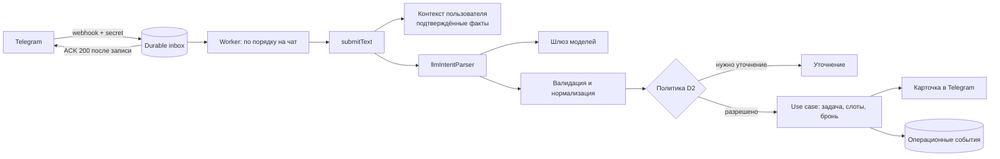

# План работ по ИИ и памяти «Стези» — v2

| | |
|---|---|
| Статус | Предложение к реализации. Требует решений из раздела 3 до начала кода |
| Дата | 1 октября 2026 |
| Заменяет | v1 этого документа |
| Основание | Ревью v1 (`AI_WORK_PLAN_REVIEW.md`), код ветки `codex/telegram-interaction-layer` на коммите `513c244`, `AGENTS.md`, ADR 0001–0004, документ сценариев этапа 0.1 |
| Область | Понимание сообщений, подтверждаемая память, следующее полезное действие, качество и стоимость ИИ. Надёжный runtime описан в той мере, в какой без него ИИ нельзя включать |

## 1. Коротко

1. Делаем один замкнутый цикл, а не платформу памяти: рабочий контекст → понятная задача или уточнение → слот → доставленное напоминание → отчёт о результате → подтверждённый факт о результате и навыке → следующее полезное действие с объяснением и ссылкой на основание.
2. ИИ подключаем **за существующими портами** Telegram-домена: `IntentParser`, `MemoryRepository`, `TranscriptionPort`, `ReminderQueue`. Новый бот, вторая модель задач и второй backend не создаются.
3. **Модель понимает, код действует.** LLM не выбирает слот, не подтверждает факты и не выполняет действий с побочными эффектами.
4. **Память MVP — только подтверждённая.** Кандидаты живут отдельно и временно; в долговременную память факт попадает после решения пользователя. Многоуровневая память, векторный поиск, реранкер и ночная консолидация — в roadmap с условиями включения (раздел 14).
5. ИИ включается для пользователей только после надёжного хранения и приёма обновлений: сейчас все хранилища бота живут в памяти процесса.
6. Каждое изменение промпта, модели или памяти проходит офлайн-проверки; живые прогоны на моделях — отдельный управляемый запуск.

## 2. Исходное состояние (проверено по коду)

| Область | Факт | Следствие |
|---|---|---|
| Базовые ветки | `main` (`74c494e`): Next.js, Node 20.20.2, web-онбординг с mock-поиском профилей. `codex/telegram-interaction-layer` (`513c244`): grammY 1.46.0, Node 22.23.3, 158 тестовых файлов | Интеграционную основу нужно выбрать явно (раздел 3, решение D1). Профили из web-онбординга не сохраняются и не являются источником памяти |
| Контракт `Intent` | Поля: `kind`, `title`, `deadline`, `durationMinutes`, `scheduledStartAt` (начало встречи, отдельно от дедлайна), `meetingUrl`, `priority`, `participants`, `confidence` | LLM-парсер обязан заполнять текущий контракт, включая `scheduledStartAt` и `meetingUrl`. Новые поля — отдельными изменениями с обновлением потребителей |
| Вход `IntentParser.parse` | `text`, `now`, `timezone`, `source: SourceRef`, `dateTimeHints`. `userId` нет | Персональный контекст передаёт оркестрация из use case, где владелец известен (`submitText` получает `userId`) |
| Контракт-тест парсера | Требует одинаковый результат для одинакового входа (`is deterministic for identical input`) | Для LLM-адаптера этот пункт неприменим; контракт нужно разделить (раздел 7.6) |
| `MemoryRecord` | `confirmedByUser: true` — литеральный тип; 7 видов записей (`working_hours`, `preferred_block_length`, `task_duration_estimate`, `actual_duration`, `reschedule_count`, `failure_reason`, `notification_response`) | Неподтверждённую запись создать нельзя. В production-коде `memory.record(...)` пока не вызывается — память не наполняется |
| Напоминания | `confirmSlot` ставит в `ReminderQueue` напоминания `block_start` и `check_in` | Доставляющего воркера нет; обработчика ответа на check-in нет. Тип `CheckIn` и карточка — это ещё не workflow |
| Вебхук | Проверяет `secret_token`, затем ждёт `handleUpdate` и только потом отвечает 200; при ошибке 500 | Тяжёлая обработка (LLM, поиск) внутри запроса недопустима: нужен надёжный приём и быстрый ответ (раздел 9) |
| Хранилища | Задачи, настройки, черновики, предложения, callbacks, дедупликация, напоминания, календарь — in-memory | До пилота — адаптеры на PostgreSQL с теми же контрактными тестами |
| Экспорт и удаление | `exportUserData` (`EXPORT_SCHEMA_VERSION = 1`) и `deleteUserData` существуют | Расширяются на каждую новую таблицу; при изменении формата версия экспорта растёт |
| Зависимости ИИ | AI SDK, zod, драйвера БД в ветке бота отсутствуют | Добавляются вместе с первым потребителем |
| Mini App (`telegram_webapp`, `codex/liquid-glass-chat-ui`) | Vite-клиент; Express/MySQL backend с шаблонными ответами `aiService`; чат работает на таймере | Клиент сохраняется и подключается к единому API. Express/MySQL не переносится (решение D1). В истории `telegram_webapp` есть отслеживаемые `.env` с непустыми секретами |
| Шлюз моделей программы | OpenAI-совместимый API; `GET /models` на 1 октября 2026 вернул 95 идентификаторов (приложение A) | Список подтверждён. Не подтверждены: поддержка JSON-схемы и tool calling у конкретных моделей, лимиты, тарифы |

## 3. Решения до начала кода (P0)

Каждое решение оформляется ADR в `docs/decisions` и утверждается техническим лидером и product owner.

| ID | Решение | Предложение |
|---|---|---|
| D1 | Единый backend и интеграционная база | Основа — Telegram-домен в Next.js (ветка `codex/telegram-interaction-layer`, влить в `main`). Production-адаптеры — PostgreSQL. Mini App — отдельный клиент того же API, изолированный от web-маршрутов; оформляется отдельным workspace как второй реальный потребитель. Express/MySQL не переносится и не сливается механически |
| D2 | Политика полномочий по действию и источнику | Матрица «действие × источник × требуется ли подтверждение». Сохраняет ADR 0004 (явно датированная встреча из пересылки бронируется сразу в собственном календаре). Запись во внешний календарь — отдельное согласие при подключении и возможность отмены; расширение ADR 0004 на внешний календарь — только отдельным решением |
| D3 | Модель памяти | Три сущности: операционные события, временные предложения (кандидаты с TTL), подтверждённая память. Новые виды записей: проект, обязательство, рабочий результат, свидетельство навыка. Происхождение записи различимо: заявлено пользователем / подтверждённый вывод / отчёт пользователя в check-in |
| D4 | Хранение и удаление | Сроки хранения исходного текста, событий и отклонённых кандидатов. Удаление каскадно охватывает источники, факты, предложения, индексы, кэш и ожидающие задачи; фоновая задача не может восстановить удалённое |
| D5 | Телеметрия ИИ | По умолчанию — только метаданные (модель, задача, токены, задержка, статус), без текста сообщений и профиля. Запись содержимого во внешние трассы — отдельная осознанная настройка с ограниченным сроком хранения |
| D6 | Календарь пилота | Либо собственный durable-календарь с честным интерфейсом о его границах, либо один внешний провайдер с отдельным согласием. Нельзя сообщать «время свободно», если внешняя занятость не подключена |
| S1 | Секреты | Отозвать токены ботов и JWT-секрет из истории `telegram_webapp`; заменить конфиги плейсхолдерами; убрать PII из логов авторизации. Удаление `.env` в новой ветке историю не очищает |
| S2 | Согласованность документов | Обновить `README.md`, `PRODUCT_CONTEXT.md`, `MVP.md`, `MANUAL_QA.md` и runtime baseline (Node 20 в `main`, Node 22 в ветке бота) под ADR 0002 |

## 4. Принципы

1. **Модель понимает, код действует.** Структурированный результат модели проходит валидацию; действие выполняет доменный use case по политике D2.
2. **Время выбирает `SlotScheduler`.** Модель может объяснить выбор, но не придумать слот.
3. **Провайдер-независимость.** SDK провайдера — только в серверном ИИ-адаптере. Домен не знает имён моделей.
4. **Подтверждение значимого.** Модель не может выставить `confirmedByUser` и не может заменить подтверждённый факт новой гипотезой.
5. **Явные сбои.** Таймаут, невалидный ответ, исчерпанный бюджет — наблюдаемые состояния с понятным сообщением пользователю. Скрытого отката на правила нет; rule-based парсер остаётся явно выбранным demo/test-адаптером.
6. **Граница полномочий, а не разделители.** Защита от prompt injection держится на том, что у модели нет инструментов с побочными эффектами, а действия идут через политику D2. Разметка чужого текста и guard-модель — дополнительные меры.
7. **Измеряем.** Решения о моделях, контексте и поиске принимаются по проверкам и сравнению «с модулем / без модуля».

## 5. Архитектура ИИ-слоя

### 5.1 Размещение кода

| Каталог | Содержимое |
|---|---|
| `src/features/ai/` | Шлюз моделей, вызов со схемой, учёт usage и стоимости, бюджет, телеметрия. Создаётся вместе с первым потребителем |
| `src/features/telegram/adapters/` | `llmIntentParser` (реализация `IntentParser` поверх шлюза), Telegram-специфичное сопоставление |
| `src/features/telegram/domain/` | Новые порты и типы памяти, use cases подтверждения, check-in, следующего действия |
| PostgreSQL-адаптеры | Рядом с in-memory адаптерами, проходят те же контрактные тесты |

Корневой каталог `agent/` не создаётся без согласования структуры.

### 5.2 Путь одного сообщения

## 6. Шлюз моделей (`src/features/ai`)

**Старт:** одна основная модель для понимания и один проверенный маршрут эскалации. Остальные роли (извлечение фактов, формулировка, эмбеддинги, STT) добавляются, когда появляется их потребитель.

1. **Capability manifest.** Для каждой используемой модели фиксируются: точный id, endpoint, поддержка `json_schema` и tool calling через этот шлюз, наличие `usage` в ответе, лимиты, цена, дата проверки. Модель без проверенного manifest в конфиг не попадает.
2. **Структурированный вывод.** Схема zod; режим JSON-схемы или tool calling — по manifest. Ответ всегда валидируется. Версии SDK фиксируются и проверяются на реальном шлюзе: OpenAI-совместимость не гарантирует поддержку всех возможностей.
3. **Общий deadline и ограниченные попытки.** Один бюджет времени на операцию; повторы только на сетевые ошибки, 5xx и 429 (с учётом `Retry-After`). Ретраи SDK и собственные ретраи не суммируются: используется один уровень.
4. **Repair.** Не более одной попытки исправить невалидный ответ. В промпт исправления передаются пути и типы нарушений схемы, но не сырые значения с пользовательскими данными.
5. **Эскалация** определяется не только `confidence` модели, но и детерминированными проверками: полнота обязательных полей, согласованность дат с `dateTimeHints`.
6. **Учёт.** На каждую попытку: задача, модель, токены (input/output/cached), задержка, статус, trace id. Стоимость считается по тарифу; если usage или тариф неизвестны — `unknown`, а не ноль.
7. **Бюджет.** Лимит на пользователя и общий предохранитель. Исчерпанный бюджет — явное состояние с сообщением пользователю; незаметная замена на непроверенную модель запрещена.
8. **Телеметрия** по решению D5: метаданные по умолчанию, запись входов и выходов выключена.

## 7. Понимание сообщений: `llmIntentParser`

### 7.1 Контракт
Заполняет текущий `Intent` полностью: `kind`, `title`, `deadline`, `durationMinutes`, `scheduledStartAt`, `meetingUrl`, `priority`, `participants`, `confidence`. Расширения (`needsClarification`, `durationSource`, ссылки на использованные факты) вводятся отдельными изменениями вместе с потребителями.

### 7.2 Время
- Все `Instant` — UTC; часовой пояс пользователя — IANA.
- Различаются дата источника (`source.sourceTimestamp`) и текущее время (`now`): «завтра» в пересланном сообщении трёхдневной давности относится к дате источника.
- Будущее обязательно для планируемого действия, но не для сообщения о уже выполненной работе.
- Дедлайн задачи и начало встречи — разные поля.

### 7.3 Персональный контекст
- Первая версия — без памяти.
- Следующим изменением `submitText` получает контекст от нового порта `UserContextProvider` по аутентифицированному `userId` и передаёт его парсеру как версионированное расширение входа.
- Владелец памяти никогда не определяется по автору пересылки или id чата.

### 7.4 Промпт
Системная часть с правилами и примерами на русском по сценариям A–E; затем стабильный контекст пользователя; затем динамическая часть (время, пояс, сообщение). Пересланный текст размечается как данные. Промпты версионируются в репозитории; версия пишется в метаданные вызова.

### 7.5 Неоднозначность
Используется существующий поток уточнения (черновики `clarify`, выбор вида). `confidence` модели калибруется на размеченном наборе, прежде чем от него зависят решения.

### 7.6 Тесты
- Контракт `IntentParser` разделяется: структурные инварианты (непустой заголовок, `info` без дедлайна, ограничения длины) — для всех адаптеров; детерминизм — только для rule-based и fake-provider.
- LLM-адаптер в обычном CI тестируется на fake-provider без сети.
- Качество живой модели — наборы раздела 12.

**Готово, когда:** текст и пересылка проходят существующие use cases с реальным парсером; нет выдуманного слота, скрытого отката и ложного сообщения об успехе; качество, задержка и расход воспроизводимо измерены.

## 8. Подтверждаемая память (MVP)

### 8.1 Три сущности

| Сущность | Что это | Жизненный цикл |
|---|---|---|
| Операционные события | Факты работы системы: задача создана, слот подтверждён, напоминание доставлено, ответ на check-in | Пишутся кодом; срок хранения по D4; основа статистики |
| Предложения (кандидаты) | Вывод модели или системы, который требует решения пользователя | TTL; не участвуют в поиске и сводках; удаляются вместе с данными пользователя |
| Подтверждённая память | `MemoryRecord` с `confirmedByUser: true` | Хранится до исправления или удаления пользователем |

### 8.2 Новые виды записей
К семи существующим видам добавляются минимальные понятия цикла «работа → результат → навык»:
- **проект** — название, статус, связи с задачами;
- **обязательство** — что, кому, к какому сроку, источник;
- **рабочий результат** — что сделано, по какой задаче или проекту, когда;
- **свидетельство навыка** — навык, связанный рабочий результат, источник.

Отметка «задача выполнена» не подтверждает навык автоматически: навык — отдельное предложение, требующее решения пользователя.

### 8.3 Происхождение и субъект
- У каждой записи: владелец (аутентифицированный пользователь), источник (событие или сообщение), автор источника, **субъект утверждения** (пользователь, другой человек, неизвестно), происхождение (заявлено пользователем / подтверждённый вывод / ответ в check-in).
- Неоднозначный субъект → уточнение, а не догадка.

### 8.4 Жизненный цикл
1. Модель или правило создаёт предложение с источником и субъектом.
2. Подтверждение, редактирование и отклонение — доменные use cases с проверкой владельца и версии предложения.
3. Подтверждённый факт не заменяется автоматически: противоречие порождает новое предложение.
4. При исправлении источника или факта зависимые записи помечаются к пересмотру.
5. Удаление каскадное по D4; перед любой фоновой записью проверяется версия (эпоха) данных пользователя, ожидающие задачи отзываются, кэш инвалидируется.
6. Отклонение не хранит чувствительный текст бессрочно: допускается минимальная отметка с TTL, удаляемая вместе с данными пользователя.

### 8.5 Статистика поведения
Средние длительности, выполнение по часам, частота переносов считаются SQL-запросами из операционных событий и подтверждённых записей во время чтения. Агрегаты не сохраняются как «факты о человеке».

### 8.6 Использование памяти (recall)
- Явные связи: задача → проект → обязательства и результаты.
- Полнотекстовый поиск PostgreSQL по подтверждённым записям владельца.
- Небольшой контекст с настраиваемым бюджетом токенов, проверяемым по задержке и стоимости.
- Кандидаты, отклонённые и удалённые записи в поиске и сводках не участвуют.
- Без подтверждённых данных агент честно работает без персонализации.

### 8.7 Интерфейс
Первый шаг — карточки в боте и список «что я о тебе знаю» с источником, исправлением и удалением. Mini App подключается позже и не блокирует цикл.

**Готово, когда:** результат сохраняется только после явного решения; следующее обращение использует его со ссылкой на источник; после исправления или удаления прежние данные не влияют на ответ и не возвращаются из очереди; другой пользователь и группа не получают приватный контекст.

## 9. Надёжный runtime (предпосылка включения ИИ)

1. **PostgreSQL-адаптеры** за существующими портами: задачи, настройки, черновики, предложения, ожидаемые ответы, callbacks, напоминания, память. In-memory адаптеры остаются для тестов и явного demo-режима.
2. **Целостность:** проверка владельца в каждой операции, атомарные переходы статусов (compare-and-set), однократное потребление callbacks, TTL, уникальность обновлений.
3. **Приём вебхука:** проверка `secret_token` → запись обновления в durable inbox → ответ 200 только после успешной записи; при ошибке записи — не 200. Обработку выполняет worker с сохранением порядка в пределах чата и идемпотентными эффектами.
4. **Доставка напоминаний:** worker над `ReminderQueue` с арендой, ограниченными повторами и наблюдаемыми сбоями. Гарантия — «как минимум один раз»: при сбое между отправкой и фиксацией возможен дубль, поэтому обработка повторов идемпотентна.
5. **Миграции, конфиги с плейсхолдерами, разделение окружений, health/readiness, процедура восстановления.** Отдельный процесс worker обосновывается ADR.

**Проверка:** контрактные наборы на настоящем PostgreSQL; перезапуск процесса; два конкурентных нажатия на один слот; два worker на одной очереди; повтор вебхука; сбой календаря; отмена до доставки; экспорт и удаление.

## 10. Check-in и одно следующее полезное действие

1. **Workflow check-in:** очередь → доставленная карточка → ответ → состояние задачи → операционное событие → предложение о рабочем результате.
2. **Кандидаты следующего действия** (стартовый список): продолжить обязательство; уменьшить следующий шаг заблокированной задачи; зафиксировать результат выполненной работы; продолжить подтверждённый проект или цель.
3. **Ранжирование** — простое объяснимое правило: срочность, связь с текущей работой, доступность действия. Причины выбора и порядок при равенстве фиксируются.
4. **Модель только формулирует** выбранную рекомендацию; каждая формулировка привязана к допустимому действию и проверенным источникам, без неподтверждённых характеристик человека.
5. **Доставка:** по запросу и после check-in. Проактивные уведомления — с отдельным согласием, тихими часами, частотой и отменой; утренние рассылки — после проверки полезности первых рекомендаций.

**Готово, когда:** пользователь проходит цикл из раздела 1; видны принятие, отклонение и выполнение рекомендации; факт завершения работы возвращается в подтверждаемую память.

## 11. Подключение Mini App

1. Vite-клиент и его визуальные компоненты сохраняются и подключаются к единому API.
2. Интерфейс показывает реальное состояние операции: принято, в обработке, нужно уточнение, предложено, подтверждено, ошибка. «Добавлено» — только после успешного доменного результата.
3. Первые экраны: задачи и действия, кандидаты памяти, подтверждённая память с источниками, настройки согласий. Свободный чат с инструментами — не условие пилота.
4. Серверная проверка `initData` (подпись, срок `auth_date`), привязка к пользователю бота, защита от повторного использования, отсутствие PII в логах, preview-bypass выключен вне DEV.
5. CI охватывает клиент, backend, API-контракты, production-сборку и основной сканер секретов и PII.

## 12. Качество

### 12.1 Наборы проверок

| Набор | Что проверяет | Условие выпуска |
|---|---|---|
| `intent-ru` | Тип, дедлайн, `scheduledStartAt`, длительность, `meetingUrl`; дата источника против `now`; относительные даты и часовые пояса; неоднозначность; прошлые результаты; отсутствующая длительность | Поля оцениваются отдельно на фиксированном holdout. Стартовые цели: тип ≥ 90%, дедлайн ≥ 85%, валидный результат ≥ 99%; уточняются по цене ошибок. Сырые и исправленные (repair) ответы считаются раздельно |
| `extract-ru` | Источник, автор, субъект, владелец; новая гипотеза не подтверждает себя; «завершил» не доказывает навык | В release-наборе нет фактов без допустимого свидетельства; указаны precision, recall и число случаев. Это не обещание нулевых ошибок в production |
| `career-evidence-ru` | Выполненная задача → результат → проект → свидетельство → возможный навык; простое действие без достижения; исправление результата | Любая выполненная задача не превращается в достижение; навык не приписывается без подтверждения |
| `memory-ru` | Одинаковый сценарий без памяти и с простым recall; подтверждение, отказ, противоречие, удаление | Память даёт измеримый прирост и не ухудшает критичные сценарии; кандидаты, отклонённые и удалённые данные не используются |
| `injection-ru` | Атаки в пересылке, сохранённом источнике, расшифровке голоса и извлечённой памяти; неизвестный субъект | Нет неразрешённых действий и подтверждений на тестовом наборе |
| Контракты и жизненный цикл | Владелец, compare-and-set, callbacks, перезапуски, конкурентная запись, задачи после удаления, схема экспорта | Детерминированные наборы без живой модели; БД-адаптеры — на настоящем PostgreSQL |
| Производительность | p95 на полном бюджете контекста с попытками и эскалацией; отдельно ACK и полезный ответ | p95 разбора ≤ 2 с — целевая гипотеза; общий deadline 8 с — предел отказа, а не доказательство SLO |

### 12.2 Правила
- `npm run verify` — без сети, секретов и живых моделей.
- Отдельные команды: контрактные тесты БД, офлайн-оценки, живая оценка с ограниченным бюджетом. Секреты — только в выбранном окружении, не в данных и отчётах публичного репозитория.
- Даты, статусы и источники проверяются кодом. Модель-судья — вспомогательная оценка естественного языка: фиксированная рубрика и версия, независимость от оцениваемой модели, ручная проверка спорных случаев.
- В наборах нет реальной переписки и профилей: только синтетические или обезличенные данные.

## 13. Стоимость, нагрузка, метрики (критерии приёмки программы)

### 13.1 Стоимость LLM на DAU
- Стоимость операции = все попытки (основная, repair, эскалация, повторы) × токены из учёта × тариф, плюс STT, фоновая обработка и инфраструктура.
- Частоты операций в Core Product Loop — гипотезы до измерения в пилоте; считаются три профиля (лёгкий, типичный, активный).
- Пока тариф неизвестен — публикуются токены и стоимость `unknown`, а не условные рубли.

### 13.2 Нагрузка
- Отдельно измеряются: ACK вебхука, задержка очереди, разбор, полный полезный ответ, опоздание напоминаний.
- 10 RPS — предварительный профиль, уточняемый прогнозом пилота.
- Нагрузка с fake-provider проверяет наш сервис, но не пропускную способность шлюза; шлюз измеряется отдельным коротким прогоном.

### 13.3 Метрики и логи
- DAU и «обращение» определяются явно; внутренний и автоматический трафик исключается.
- Метрики ценности: первый завершённый полезный цикл, принятие и выполнение действия, подтверждение и исправление памяти, фиксация рабочего результата, повторное использование подтверждённого контекста, удержание D1/D7.
- Технические: ошибки по типам, задержки по этапам, расход по задачам шлюза.
- Хранение — в PostgreSQL с выгрузкой; логи структурированы и по умолчанию без PII. Сложный стек наблюдаемости (внешние трассы, наборы данных, дашборды) — после минимального учёта и редактирования чувствительных данных.

## 14. Roadmap после пилота

Каждый пункт включается только при выполнении условия; эффект проверяется сравнением «с модулем / без модуля» по качеству, задержке и стоимости.

| Модуль | Условие включения |
|---|---|
| Эмбеддинги + pgvector, гибридный поиск с RRF | Полнотекстовый поиск и явные связи доказанно не находят нужные данные |
| Реранкер | Гибридный поиск возвращает нужное, но не в топе |
| Сводки по проектам и людям, компактный профиль | Подтверждённых фактов становится больше, чем помещается в бюджет контекста |
| Ночная консолидация и гипотезы о поведении | Накоплена статистика и проверена безопасность обновлений (раздел 8.4) |
| Разрешение сущностей с LLM, обход связей | Зафиксированы реальные случаи неоднозначных людей и проектов |
| Голос (STT через `TranscriptionPort`) | Стабилен текстовый цикл; проверены формат, лимиты и удаление аудио. Если голос нужен для первой продуктовой проверки — отдельный приоритет без изменения общего конвейера |
| Свободный чат в Mini App, OCR, новые интеграции | Отдельные подтверждённые этапы |

При смене модели эмбеддингов — отдельный индекс и переиндексация; векторы разных моделей не смешиваются.

### 14.1 Исследовательская база

| Система | Идея, которую можно взять | Когда | Оговорка |
|---|---|---|---|
| TencentDB Agent Memory | Уровни от сырых диалогов к фактам, сценариям и профилю; поиск «сначала крупно, потом детали»; гибридный BM25 + вектор + RRF | Сводки, профиль, гибридный поиск | Проект быстро развивается (сейчас позиционируется как командная память); выводы привязывать к версии. Для MVP достаточно собственного небольшого домена |
| Mastra Observational Memory | Датированные наблюдения только на дописывание; стабильный префикс промпта для кэша | Компактный контекст | 94,87% на LongMemEval — авторский замер для конкретной конфигурации (`gpt-5-mini`) |
| Hindsight | Разделение фактов и гипотез с уверенностью; сводки по сущностям; несколько каналов поиска | Гипотезы, сводки | Результаты зависят от модели и настроек; авторские замеры |
| Zep / Graphiti | Время действия факта; противоречие закрывает старый факт, а не стирает | Конфликты фактов | В нашем MVP конфликт решает пользователь (раздел 8.4) |
| Letta | Фоновая консолидация памяти | Ночная консолидация | Агентное редактирование памяти моделью — не для MVP |
| LongMemEval | Категории: один факт, предпочтения, обновление знаний, время, несколько сессий, отказ | Структура `memory-ru` | Общий балл не заменяет проверок подтверждения, источников, удаления и полезности действия |

## 15. Этапы и зависимости

Без календарных дат: сроки назначаются после решений раздела 3.

| Этап | Содержание | Ответственные | Зависит от |
|---|---|---|---|
| 0 | Решения D1–D6, S1–S2; интеграционная ветка `codex/`; карта «реализовано / демо / отсутствует» по сценариям A–E с проверкой обработчиков | Техлид, product owner | — |
| 1 | Надёжный runtime (раздел 9) | Backend | 0 |
| 2 | Capability manifest, шлюз, `llmIntentParser` (разделы 6–7). Шлюз и оценки можно готовить параллельно с этапом 1 без включения живой модели | AI/backend | 0; включение для пользователей — после 1 |
| 3 | Подтверждаемая память и рабочие результаты (раздел 8) | Backend/AI; frontend — интерфейс решения | 1, 2 |
| 4 | Check-in и следующее действие (раздел 10) | Backend/AI/product | 3, доставка из 1 |
| 5 | Mini App (раздел 11); интерфейс можно готовить раньше на контрактных mock | Frontend + backend | API и identity из 0; память из 3 |
| 6 | Пилот: качество и экономика (разделы 12–13) | AI/backend/product | Замкнутый цикл |

## 16. Первые задачи

1. ADR D1 и D2 (единый backend; политика полномочий с учётом ADR 0004).
2. Отзыв секретов из истории `telegram_webapp`, проверка истории сканером без вывода значений.
3. Карта существующих контрактов и сценариев A–E: что реализовано обработчиками, что только в рендере и тестах.
4. Capability manifest: 3–4 кандидата из приложения A — проверка JSON-схемы, tool calling, `usage`, задержки и лимитов на реальном шлюзе; запрос тарифов у организаторов.
5. Минимальный раннер офлайн-оценок и первая версия `intent-ru` (holdout фиксируется до подбора промптов).
6. Шлюз моделей с общим deadline, ограниченными попытками, учётом и бюджетом; тесты на fake-provider.
7. `llmIntentParser` за текущим портом; разделение контракт-теста; сравнение 2–3 моделей на `intent-ru`.

## 17. Риски

| Риск | Мера |
|---|---|
| Два backend и расхождение контрактов | D1; единый API и модель данных; карта контрактов |
| Потеря состояния in-memory | Раздел 9 до пилота |
| Модель не держит JSON-схему через шлюз | Capability manifest, tool calling, один repair |
| Ложное «добавлено» и выдуманные слоты | Действия только через use cases и политику D2; проверки в `intent-ru` |
| Выдуманные факты и навыки | Предложения вместо записи, источники, `extract-ru`, `career-evidence-ru` |
| Восстановление удалённого фоновыми задачами | Эпоха данных пользователя, отзыв задач, инвалидирование кэша |
| Prompt injection через пересылки | Граница полномочий, `injection-ru`, guard как дополнительная мера |
| Рост расходов | Учёт всех попыток, бюджет с явным исчерпанием, измеренные частоты |
| Утечка содержимого в телеметрию | D5: метаданные по умолчанию |
| Устаревшие документы | S2 |

## Приложение A. Модели шлюза (снимок 1 октября 2026)

Источник: `GET /models` шлюза программы, 95 идентификаторов. Возможности, лимиты и тарифы не проверены — проверяются в capability manifest. Выбор по названию модели не делается.

| Роль | Кандидаты для сравнения |
|---|---|
| Понимание (основная) | `gpt-5.4-mini`, `gemini-3.1-flash-lite`, `claude-haiku-4.5`, `deepseek-v4-flash`, `qwen3.6-35b-a3b`, `gigachat3-10b-a1.8b` |
| Эскалация | `gpt-5.4`, `claude-sonnet-4.6`, `gemini-3-flash-preview` |
| GigaChat (запланированный провайдер, оценивается по тем же критериям) | `gigachat-3-pro`, `gigachat-2-max`, `gigachat3.5-432b-a28b` |
| Эмбеддинги (roadmap) | `qwen3-embedding-0.6b`, `bge-m3`, `text-embedding-3-large`, `gemini-embedding-001` |
| Реранкер (roadmap) | `bge-reranker-v2-m3`, `qwen3-reranker-0.6b` |
| STT (roadmap) | `whisper-large-v3` |
| Guard (дополнительная мера) | `hivetraceguard-pro` |

## Приложение B. Источники

Заполняется по итогам проверки внешних утверждений.
