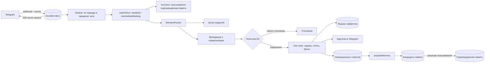

# План работ по ИИ и памяти «Стези» — v2

| | |
|---|---|
| Статус | Предложение к реализации. Код начинается после решений раздела 3 |
| Дата | 1 октября 2026 |
| Заменяет | v1 этого документа |
| Основание | Ревью v1 (`AI_WORK_PLAN_REVIEW.md`); код ветки `codex/telegram-interaction-layer` на коммите `513c244`; спецификация `docs/superpowers/specs/2026-09-26-telegram-interaction-layer-design.md` (сценарии A–E, напоминания, check-in); продуктовый документ этапа 0.1 (вне репозитория); `AGENTS.md`; ADR 0001–0004; критерии приёмки MVP программы Sber500 x Disrupt |
| Область | Понимание сообщений, подтверждаемая память, следующее полезное действие, качество и стоимость ИИ, а также надёжная среда выполнения, без которой ИИ нельзя включать для пользователей |
| Ветка документа | Временно `claude/charming-edison-vus7tm`; на этапе 0 переносится в интеграционную ветку `codex/` |

Термины объяснены в приложении C.

## 1. Коротко

1. Строим **один замкнутый цикл**, а не платформу памяти: рабочий контекст → понятная задача или уточнение → слот → доставленное напоминание → отчёт о результате → подтверждённый факт о результате и навыке → следующее полезное действие с объяснением и ссылкой на основание.
2. ИИ подключаем **за существующими портами** Telegram-домена (`IntentParser`, `MemoryRepository`, `TranscriptionPort`) и за минимальным числом новых портов (контекст пользователя, кандидаты памяти, операционные события). Новый бот, вторая модель задач и второй backend не создаются.
3. **Модель понимает, код действует.** LLM не назначает слот, не подтверждает факты и не выполняет действий с побочными эффектами.
4. **Память MVP — только подтверждённая.** Кандидаты памяти хранятся отдельно и временно; в долговременную память факт попадает после решения пользователя. Многоуровневая память, векторный поиск, реранкер и ночная консолидация — в roadmap с условиями включения (раздел 14).
5. **ИИ включается для пользователей только после надёжной среды выполнения:** сейчас все хранилища бота живут в памяти процесса.
6. **Измеряем.** Каждое изменение промпта, модели или памяти проходит офлайн-проверки; прогоны на живых моделях — отдельный управляемый запуск.

## 2. Исходное состояние (проверено по коду)

Пути ниже — относительно `src/features/telegram/` ветки `codex/telegram-interaction-layer@513c244`.

| Область | Факт | Следствие |
|---|---|---|
| Базовые ветки | `main` (`74c494e`): Next.js, Node 20.20.2, web-онбординг с mock-поиском профилей. Ветка бота: grammY 1.46.0, Node 22.23.3, 158 тестовых файлов | Интеграционная основа выбирается явно (D1). Профили из web-онбординга не сохраняются и не являются источником памяти. AI SDK 7 требует Node ≥ 22 — выравнивание версий обязательно |
| Контракт `Intent` | `kind`, `title`, `deadline`, `durationMinutes`, `scheduledStartAt` (начало встречи, отдельно от дедлайна), `meetingUrl`, `priority`, `participants`, `confidence` (`domain/types.ts:37-50`) | LLM-парсер заполняет текущий контракт полностью. Новые поля — отдельными изменениями с обновлением потребителей |
| Вход `IntentParser.parse` | `text`, `now`, `timezone`, `source`, `dateTimeHints`; `userId` нет (`domain/ports.ts:40-48`). Вызывают три use case: `submitText`, `taskEdit`, `rescheduleMeeting`; у всех есть `userId` | Персональный контекст передаёт оркестрация из use case, где владелец известен |
| Выбор парсера | `createInMemoryServices` подставляет `createRuleBasedIntentParser()`, если парсер не передан (`bot/inMemoryServices.ts:50`); production-маршрут вебхука собирает `createInMemoryServices` целиком | Неявные дефолты противоречат правилу «без тихих откатов»: адаптеры выбираются конфигурацией явно |
| Контрактный тест парсера | Требует одинаковый результат для одинакового входа; заголовок набора говорит, что он покрывает и будущие LLM-адаптеры (`testing/contracts/intentParser.contract.ts:32-36,75`) | Для LLM-адаптера детерминизм неприменим; контракт разделяется (раздел 7.6) |
| Ошибки разбора | `submitText` превращает в результат только `InvalidIntentError`; остальное пробрасывается → вебхук отвечает 500 → Telegram повторяет доставку | Таймаут LLM превратится в повторные платные вызовы. Нужна таксономия ошибок (раздел 6) |
| `MemoryRecord` | `confirmedByUser: true` — литеральный тип; 7 видов: `working_hours`, `preferred_block_length`, `task_duration_estimate`, `actual_duration`, `reschedule_count`, `failure_reason`, `notification_response`. `memory.record(...)` в production-коде не вызывается | Неподтверждённую запись создать нельзя; память пока только экспортируется и удаляется. Четыре вида — по сути наблюдения системы; их место решается в D3 |
| Порты | `ReminderQueue.markSent/markFailed` не принимают токен аренды; у `MemoryRepository` нет исправления и удаления отдельной записи; хранилища `CheckIn` нет (есть только тип) | Порты расширяются вместе с контрактными тестами |
| Напоминания | `confirmSlot` ставит `block_start` (если напоминание включено и время ещё в будущем) и `check_in` — только для задач, не для встреч; `bookMeeting` ставит только `block_start`. Контракт очереди уже содержит аренду, backoff и `MAX_REMINDER_ATTEMPTS = 5` | Доставляющего worker нет. Есть callback-действия `checkin.answer`, `checkin.reason` и карточка check-in, но обработчиков нет. Встречи check-in не получают |
| Вебхук | Проверяет `secret_token` (403 при несовпадении, 400 на невалидное тело), ждёт `handleUpdate` и только потом отвечает 200; при ошибке 500 | Тяжёлая обработка внутри запроса недопустима (раздел 9) |
| Состояние процесса | Хранилища портов in-memory (задачи, настройки, черновики, предложения слотов, ожидаемые ответы, callbacks, дедупликация с окном 7 дней, напоминания, память, календарь). Вне портов: 5-минутный таймер «добавьте детали встречи» (`handlers/personal/outcomes.ts`), буфер альбомов (обновление подтверждается до обработки, сбой только логируется), `promptTracker` | Всё переносится в PostgreSQL или durable jobs (раздел 9) |
| Подписки на обновления | `ALLOWED_UPDATES` включает `edited_message`, `inline_query`, `chosen_inline_result`, `my_chat_member`, `guest_message`, но обработчиков для них нет, хотя комментарий в `bot/allowedUpdates.ts` требует подписываться только при наличии обработчика | Inline-режим не реализован; подписки приводятся в соответствие на этапе 0 |
| Экспорт и удаление | `exportUserData` (`EXPORT_SCHEMA_VERSION = 1`) и `deleteUserData` существуют | Расширяются на каждую новую таблицу; при изменении формата версия растёт |
| Зависимости и CI | AI SDK, zod и драйверов БД нет; в CI нет сервиса PostgreSQL; `security:scan` проверяет только рабочее дерево | Зависимости добавляются вместе с первым потребителем; CI получает PostgreSQL; для истории нужен отдельный сканер |
| Mini App | Vite-клиент; Express/MySQL/Redis backend с шаблонными ответами `aiService`; чат на таймере 4,4 с; сервис авторизации логирует данные пользователя Telegram и хеши; обход авторизации для превью ограничен режимом разработки | Клиент сохраняется и подключается к единому API; Express/MySQL не переносится (D1). В истории `telegram_webapp` (коммит `f483034`) отслеживается `backend/.env` с непустыми `JWT_SECRET` и `TELEGRAM_BOT_TOKEN` (в `frontend/.env` только `VITE_API_URL`); в `codex/liquid-glass-chat-ui` файлы удалены, но остаются в истории |

**Шлюз моделей программы** (не код, проверено запросом): OpenAI-совместимый API; `GET /models` 1 октября 2026 года вернул 95 идентификаторов (приложение A). Не подтверждены: поддержка JSON-схемы и tool calling у конкретных моделей, наличие `usage` в ответах, лимиты (включая TPM), тарифы. Способ и дата проверки фиксируются в capability manifest без адресов и ключей.

## 3. Решения до начала кода (P0)

D1–D8 оформляются как ADR 0005–0012 в интеграционной ветке после слияния ветки бота (на `main` сейчас только ADR 0001; ADR 0002–0004 существуют в ветке бота). ADR 0004 получает пометку «дополнен ADR 0006». S1–S3 — обязательные задачи, а не ADR. Утверждают технический лидер и product owner.

| ID | Решение | Предложение |
|---|---|---|
| D1 | Единый backend и интеграционная база | Основа — Telegram-домен в Next.js; ветка бота вливается в интеграционную ветку `codex/`, затем в `main`. Production-адаптеры — PostgreSQL. Mini App — отдельный клиент того же API, изолированный от web-маршрутов; выносится в отдельный пакет репозитория, потому что это реальный второй потребитель API (правило `AGENTS.md`). Express/MySQL не переносится и не сливается механически |
| D2 | Политика полномочий по действию и источнику | Матрица «действие × источник × нужно ли подтверждение». Сохраняет ADR 0004: приватная пересылка с явным будущим началом встречи и высокой уверенностью бронируется сразу. ADR 0004 принят для локальной среды и требует сначала оценить LLM-парсер на реальных пересылках, поэтому для пилота решение подтверждается заново, с детерминированной защитой (раздел 4, п. 2). Сейчас код бронирует при уверенности ≥ 0,5 — порог пересматривается по калибровке. Запись во внешний календарь — отдельное согласие при подключении и возможность отмены; расширение ADR 0004 на внешний календарь — только отдельным решением |
| D3 | Модель памяти | Три сущности: операционные события, кандидаты памяти (временные, с TTL), подтверждённая память. Новые виды записей: проект, обязательство, рабочий результат, свидетельство навыка. Происхождение записи различимо: заявлено пользователем / подтверждённый вывод / ответ в check-in. Решить, остаются ли `actual_duration`, `reschedule_count`, `failure_reason`, `notification_response` видами памяти или становятся операционными событиями (раздел 8.6). Хранение кандидатов в PostgreSQL с TTL обосновывается в этом ADR: это временное предложение пользователю, а не долговременная память |
| D4 | Хранение и удаление | Сроки хранения исходного текста, событий, inbox, таблицы дедупликации, логов, артефактов оценок и отклонённых кандидатов. Удаление каскадно охватывает источники, факты, кандидатов, индексы, кэш и ожидающие задачи; фоновая задача не может восстановить удалённое. Шифрование чувствительных полей |
| D5 | Телеметрия и передача данных моделям | По умолчанию в телеметрию — только метаданные (задача, модель, токены, задержка, статус), без текста сообщений и профиля. Запись содержимого во внешние трассы — отдельная настройка с ограниченным сроком хранения. Передача текста пользователя внешним моделям через шлюз раскрывается в согласии; требования к трансграничной передаче проверяются |
| D6 | Календарь пилота | Либо собственный durable-календарь с честным интерфейсом о его границах, либо один внешний провайдер с отдельным согласием. Нельзя сообщать «время свободно», если внешняя занятость не подключена |
| D7 | Хостинг и окружения | Публичный HTTPS-адрес (критерий программы «не localhost»), управляемый или резервируемый PostgreSQL, статический HTTPS-хостинг Mini App (`TELEGRAM_MINI_APP_URL`). Окружения `development / test / production` (переменная `TELEGRAM_ENV` уже есть): отдельные боты, секреты вебхука, базы данных и ключи шлюза. Названный менеджер секретов и процедура ротации |
| D8 | Процесс worker | Отдельный процесс из того же кода для inbox, напоминаний и фоновых задач; обосновывается по правилам `AGENTS.md` и ADR 0001 |
| S1 | Секреты | Отозвать `TELEGRAM_BOT_TOKEN` и `JWT_SECRET` из `backend/.env` (коммит `f483034`) и токен бота, переданный вне репозитория; сканировать историю всех удалённых веток отдельным сканером секретов без вывода значений; убрать PII из логов авторизации. Удаление `.env` в новой ветке историю не очищает |
| S2 | Согласованность документов | Обновить `README.md`, `PRODUCT_CONTEXT.md`, `MVP.md`, `MANUAL_QA.md` под ADR 0002; выровнять Node (20 в `main`, 22 в ветке бота) — это обязательное условие для AI SDK 7; подготовить описание архитектуры (C4 и схема развёртывания) |
| S3 | Ответственные | У каждого этапа один ответственный; имена ведутся в трекере задач, а не в публичном репозитории |

## 4. Принципы

1. **Модель понимает, код действует.** Структурированный результат модели проходит валидацию; действие выполняет доменный use case по политике D2.
2. **Время назначает `SlotScheduler`.** Модель может объяснить выбор, но не может сама назначить слот. Исключение по ADR 0004: время встречи из приватной пересылки бронируется сразу, только если `scheduledStartAt` детерминированно совпадает с `dateTimeHints` или с разбором текста кодом, а уверенность откалибрована; иначе — предложение слотов или уточнение.
3. **Независимость от провайдера.** SDK провайдера — только в серверном ИИ-адаптере. Домен не знает имён моделей.
4. **Подтверждение значимого.** Модель не может выставить `confirmedByUser` и не может заменить подтверждённый факт новой гипотезой.
5. **Явные сбои.** Таймаут, невалидный ответ, исчерпанный бюджет — наблюдаемые состояния с понятным сообщением пользователю. Скрытого отката на правила нет: rule-based парсер остаётся явно выбранным адаптером для демо и тестов, неявный дефолт в `inMemoryServices` убирается.
6. **Защищает граница полномочий, а не разделители в промпте.** У модели нет инструментов с побочными эффектами, действия идут через политику D2. Разметка чужого текста и guard-модель — дополнительные меры.
7. **Измеряем.** Решения о моделях, контексте и поиске принимаются по проверкам и сравнению «с модулем / без модуля».
8. **Шифрование** при передаче (TLS) и при хранении (БД и резервные копии; чувствительные поля — по D4).
9. **Правила разработки `AGENTS.md`.** Изменение поведения начинается с падающего теста; `npm run check` после каждого изменения; контрактные тесты при изменении порта; `npm run security:scan` перед каждым коммитом; работа в ветках `codex/`.

## 5. Архитектура ИИ-слоя

### 5.1 Размещение кода

| Каталог | Содержимое |
|---|---|
| `src/features/ai/` | Шлюз моделей, вызов со схемой, учёт usage и стоимости, бюджет, телеметрия. Создаётся вместе с первым потребителем |
| `src/features/telegram/adapters/` | `llmIntentParser` — реализация `IntentParser` поверх шлюза; Telegram-специфичное сопоставление |
| `src/features/telegram/domain/` | Новые порты и типы памяти; use cases кандидатов памяти, check-in и следующего действия |
| PostgreSQL-адаптеры | Рядом с in-memory адаптерами; проходят те же контрактные тесты |

Корневой каталог `agent/` не создаётся без согласования структуры.

### 5.2 Путь одного сообщения



## 6. Шлюз моделей (`src/features/ai`)

**Старт:** одна основная модель для понимания и одна проверенная модель для эскалации. Остальные роли (извлечение кандидатов, формулировка, эмбеддинги, STT) добавляются, когда появляется их потребитель.

1. **Capability manifest.** Для каждой используемой модели фиксируются: точный id, endpoint, поддержка `json_schema` и tool calling через этот шлюз, наличие `usage` в ответе, лимиты (RPM, TPM), цена, дата проверки. Модель без проверенного manifest в конфиг не попадает.
2. **Структурированный вывод.** AI SDK 7 (`ai@7.x`): `generateText({ output: Output.object({ schema }) })` со схемой zod; `generateObject` объявлен устаревшим. Провайдер `@ai-sdk/openai-compatible@3.x`: при `supportsStructuredOutputs: false` (значение по умолчанию) он отправляет `json_object` без схемы и выдаёт лишь предупреждение — наш адаптер считает такое предупреждение ошибкой; флаг включается по manifest, иначе используется tool calling. Ответ всегда валидируется. Версии фиксируются и проверяются на реальном шлюзе. STT и реранкер этот провайдер не покрывает — для них отдельные адаптеры с тем же учётом.
3. **Общий таймаут операции и ограниченные попытки.** Один бюджет времени на операцию (`timeout.totalMs` или `AbortSignal`, который передаётся и в порт); повторы только на сетевые ошибки, 5xx и 429 (с учётом `Retry-After`). Повторы SDK (по умолчанию `maxRetries: 2`) и собственные не суммируются: если повторы наши, в SDK `maxRetries: 0`.
4. **Исправление ответа (repair).** Не более одной попытки исправить невалидный ответ. В промпт исправления передаются пути и типы нарушений схемы, но не сырые значения с пользовательскими данными.
5. **Эскалация** определяется не только `confidence` модели, но и детерминированными проверками: полнота обязательных полей, согласованность дат с `dateTimeHints`.
6. **Таксономия ошибок.** Таймаут, исчерпанный бюджет, невалидный ответ после repair, отказ шлюза — доменные ошибки и отдельные варианты результата use case (`SubmitTextResult` и аналоги), а не исключения, ведущие к 500 и повторной доставке.
7. **Учёт.** На каждую попытку: задача, модель, токены (input/output/cached), задержка, статус, trace id. Стоимость считается по тарифу; если usage или тариф неизвестны — `unknown`, а не ноль.
8. **Бюджет.** Лимит на пользователя и общий предохранитель. Исчерпанный бюджет — явное состояние с сообщением пользователю; незаметная замена на непроверенную модель запрещена.
9. **Телеметрия** по решению D5. В AI SDK 7 запись входов и выходов при подключённой интеграции включена по умолчанию, поэтому выключается явно: `telemetry: { recordInputs: false, recordOutputs: false }` (OpenTelemetry — пакет `@ai-sdk/otel`). Для `usage` в потоковом режиме у OpenAI-совместимого провайдера нужен `includeUsage`.

## 7. Понимание сообщений: `llmIntentParser`

### 7.1 Контракт
Заполняет текущий `Intent` полностью. Расширения (`needsClarification`, `durationSource`, ссылки на использованные факты, отметка «сообщение о выполненной работе») вводятся отдельными изменениями вместе с потребителями.

### 7.2 Время
- Все `Instant` — UTC; часовой пояс пользователя — IANA.
- Различаются дата источника (`source.sourceTimestamp`; для пересылки — дата оригинала) и текущее время (`now`): «завтра» в пересланном сообщении трёхдневной давности относится к дате источника. Сейчас rule-based парсер считает от `now`, поэтому правило вводится как изменение поведения с тестом.
- Будущее обязательно для планируемого действия, но не для сообщения об уже выполненной работе.
- Дедлайн задачи и начало встречи — разные поля.

### 7.3 Персональный контекст
- Первая версия — без памяти.
- Следующим изменением все вызовы `IntentParser.parse` (`submitText`, `taskEdit`, `rescheduleMeeting`) получают контекст от нового порта `UserContextProvider` по аутентифицированному `userId` и передают его парсеру как версионированное расширение входа.
- Владелец памяти никогда не определяется по автору пересылки или по id чата.

### 7.4 Промпт
Системная часть с правилами и примерами на русском по сценариям A–E; затем стабильный контекст пользователя (стабильное начало промпта кэшируется провайдерами); затем динамическая часть (время, пояс, сообщение). Пересланный текст размечается как данные. Промпты версионируются в репозитории; версия пишется в метаданные вызова.

### 7.5 Неоднозначность
Используется существующий поток уточнения (черновики `clarify`, выбор вида; сейчас порог `CLARIFY_THRESHOLD = 0.5`). `confidence` модели калибруется на размеченном наборе, прежде чем от него зависят решения и пороги.

### 7.6 Тесты
- Контракт `IntentParser` разделяется, заголовок набора обновляется: структурные инварианты (непустой заголовок, `info` без дедлайна, ограничения длины) — для всех адаптеров; детерминизм — только для rule-based и fake-provider.
- LLM-адаптер в обычном CI тестируется на fake-provider без сети.
- Качество живой модели — наборы раздела 12.

**Готово, когда:** текст и пересылка проходят существующие use cases с реальным парсером; нет выдуманного слота, скрытого отката и ложного сообщения об успехе; качество, задержка и расход воспроизводимо измерены.

## 8. Подтверждаемая память (MVP)

### 8.1 Откуда берутся кандидаты памяти
- Use case `proposeMemory` вызывается после `submitText` (пересылки с обязательствами и проектами; сообщения «я сделал X» — через версионированное расширение `Intent`) и после перехода задачи в `done`.
- Отметить результат можно не только через check-in: кнопка «Готово» на карточке задачи и команда `/done`.
- Без этих источников цикл «работа → результат → навык» получал бы данные только из check-in по забронированным задачам.

### 8.2 Три сущности

| Сущность | Что это | Жизненный цикл |
|---|---|---|
| Операционные события | Факты работы системы: задача создана, слот подтверждён, напоминание доставлено, ответ на check-in | Пишутся кодом; срок хранения по D4; основа статистики |
| Кандидаты памяти | Вывод модели или правила, требующий решения пользователя | TTL; не участвуют в поиске и сводках; удаляются вместе с данными пользователя |
| Подтверждённая память | `MemoryRecord` с `confirmedByUser: true` | Хранится до исправления или удаления пользователем |

### 8.3 Новые виды записей
К существующим видам добавляются минимальные понятия цикла «работа → результат → навык»:
- **проект** — название, статус, связи с задачами;
- **обязательство** — что, кому, к какому сроку, источник;
- **рабочий результат** — что сделано, по какой задаче или проекту, когда;
- **свидетельство навыка** — навык, связанный рабочий результат, источник.

Отметка «задача выполнена» не подтверждает навык автоматически: навык — отдельный кандидат памяти, требующий решения пользователя.

### 8.4 Происхождение и субъект
- У каждой записи: владелец (аутентифицированный пользователь), источник (событие или сообщение), автор источника, **субъект утверждения** (пользователь, другой человек, неизвестно), происхождение (заявлено пользователем / подтверждённый вывод / ответ в check-in).
- Неоднозначный субъект → уточнение, а не догадка.

### 8.5 Жизненный цикл
1. Модель или правило создаёт кандидата памяти с источником и субъектом.
2. Подтверждение, редактирование и отклонение — доменные use cases с проверкой владельца и версии кандидата.
3. Подтверждённый факт не заменяется автоматически: противоречие порождает нового кандидата.
4. При исправлении источника или факта зависимые записи помечаются для пересмотра.
5. Удаление каскадное по D4; перед любой фоновой записью проверяется эпоха данных пользователя, ожидающие задачи отзываются, кэш инвалидируется.
6. Отклонение не хранит чувствительный текст бессрочно: допускается минимальная отметка с TTL, удаляемая вместе с данными пользователя.
7. `MemoryRepository` получает исправление и удаление отдельной записи — с контрактными тестами.

### 8.6 Статистика поведения
Средние длительности, выполнение по часам, частота переносов считаются SQL-запросами из операционных событий и подтверждённых записей во время чтения. Агрегаты не сохраняются как «факты о человеке». Ответ пользователя в check-in — его собственное заявление и может стать записью памяти; производные от него числа — нет (см. D3).

### 8.7 Использование памяти (recall)
- Явные связи: задача → проект → обязательства и результаты.
- Полнотекстовый поиск PostgreSQL по подтверждённым записям владельца: конфигурация `russian` (стемминг Snowball) для текста и `simple` для имён и Telegram-хендлов.
- Небольшой контекст с настраиваемым бюджетом токенов, проверяемым по задержке и стоимости.
- Кандидаты, отклонённые и удалённые записи в поиске и сводках не участвуют.
- Без подтверждённых данных агент честно работает без персонализации.

### 8.8 Интерфейс
Первый шаг — карточки в боте и список «что я о тебе знаю» с источником, исправлением и удалением. Mini App подключается позже и не блокирует цикл.

**Готово, когда:** результат сохраняется только после явного решения; следующее обращение использует его со ссылкой на источник; после исправления или удаления прежние данные не влияют на ответ и не возвращаются из очереди; другой пользователь и группа не получают приватный контекст.

## 9. Надёжная среда выполнения (условие включения ИИ)

1. **PostgreSQL-адаптеры** за существующими портами: задачи, настройки, черновики, предложения слотов, ожидаемые ответы, callbacks, напоминания, память, дедупликация, `promptTracker`. In-memory адаптеры остаются для тестов и явного демо-режима.
2. **Целостность:** проверка владельца в каждой операции, атомарные переходы статусов (compare-and-set), однократное потребление callbacks, TTL.
3. **Приём вебхука.** Проверка `secret_token` (заголовок `X-Telegram-Bot-Api-Secret-Token`) → запись обновления в durable inbox → ответ 200 только после успешной записи; при ошибке записи — не 200 (Telegram повторит доставку; недоставленные обновления Telegram хранит не дольше 24 часов).
4. **Устройство inbox.**
   - Уникальный ключ `(bot_id, update_id)`; окно дедупликации — от 24 часов до 7 дней (после недели без обновлений Telegram начинает нумерацию со случайного значения).
   - Поля: `chat_key`, статус, `lease_until`, число попыток.
   - Захват: самая ранняя ожидающая строка чата, если у этого чата нет строки в обработке; блокировка на уровне чата через `pg_try_advisory_xact_lock(hashtext(chat_key))`. Одного `FOR UPDATE SKIP LOCKED` недостаточно: worker может пропустить заблокированную раннюю строку и взять более позднюю того же чата.
   - Истёкшая аренда возвращает строку в очередь; после N попыток — dead-letter и понятное сообщение пользователю.
   - Альбомы собираются в inbox по `media_group_id`; таймеры (например, «добавьте детали встречи») становятся durable jobs.
5. **Доставка напоминаний.** Worker над `ReminderQueue` с арендой (`claimDue` через `SELECT … FOR UPDATE SKIP LOCKED`), ограниченными повторами и наблюдаемыми сбоями; `markSent/markFailed` принимают токен аренды. Гарантия — «как минимум один раз».
6. **Идемпотентность побочных эффектов.** Журнал эффектов `(update_id, шаг)` хранит `message_id` и `booking_id` в одной транзакции с изменением состояния; бронь — с ключом идемпотентности. Остаточный риск дубля отправки при сбое между вызовом Telegram и фиксацией документируется.
7. **Миграции:** один инструмент, только вперёд, схема expand/contract, отдельный шаг релиза. CI применяет миграции к пустой БД и запускает контрактные наборы (job с сервисом PostgreSQL). Переноса данных из in-memory нет.
8. **Эксплуатация:** конфиги с плейсхолдерами, окружения по D7, health и readiness, резервное копирование и процедура восстановления; процесс worker по D8.

**Проверка:** контрактные наборы на настоящем PostgreSQL; перезапуск процесса; два конкурентных нажатия на один слот; два worker на одной очереди; порядок обновлений одного чата при нескольких worker; повтор вебхука; сбой календаря; отмена до доставки; экспорт и удаление.

## 10. Check-in («Как прошло?») и одно следующее полезное действие

1. **Check-in.** Очередь → доставленная карточка → ответ (обработчики `checkin.answer`, `checkin.reason`) → состояние задачи → операционное событие → кандидат памяти о рабочем результате. Нужно хранилище `CheckIn`. Детерминированная часть check-in делается на этапе 1 вместе с доставкой напоминаний. Нужен ли check-in для встреч — продуктовое решение этапа 0.
2. **Варианты следующего действия** (стартовый список): продолжить обязательство; уменьшить следующий шаг заблокированной задачи; зафиксировать результат выполненной работы; продолжить подтверждённый проект или цель.
3. **Ранжирование** — простое объяснимое правило: срочность, связь с текущей работой, доступность действия. Причины выбора и порядок при равенстве фиксируются.
4. **Модель только формулирует** выбранную рекомендацию; каждая формулировка привязана к допустимому действию и проверенным источникам, без неподтверждённых характеристик человека.
5. **Доставка:** по запросу и после check-in. Проактивные уведомления — с отдельным согласием, тихими часами, частотой и отменой; утренние рассылки — после проверки полезности первых рекомендаций.

**Готово, когда:** пользователь проходит цикл из раздела 1; видны принятие, отклонение и выполнение рекомендации; факт завершения работы возвращается в подтверждаемую память.

## 11. Подключение Mini App

1. Vite-клиент и его визуальные компоненты сохраняются и подключаются к единому HTTP API.
2. Интерфейс показывает реальное состояние операции: принято, в обработке, нужно уточнение, предложено, подтверждено, ошибка. «Добавлено» — только после успешного доменного результата.
3. Первые экраны: задачи и действия, кандидаты памяти, подтверждённая память с источниками, настройки согласий. Свободный чат с инструментами — не условие пилота.
4. Серверная аутентификация по `initData`: HMAC-подпись с ключом `WebAppData`; проверка свежести `auth_date` и защита от повторного использования — наши дополнительные меры; привязка к пользователю бота; отсутствие PII в логах; обход авторизации для превью отключён вне режима разработки.
5. CI охватывает клиент, backend, API-контракты, production-сборку и основной сканер секретов и PII.

**Готово, когда:** бот и Mini App видят одну задачу и одну память одного владельца; подтверждение или изменение в одном интерфейсе согласовано с другим; production-сборка проходит; превью не имитирует реального пользователя.

## 12. Качество

### 12.1 Наборы проверок

| Набор | Что проверяет | Условие выпуска |
|---|---|---|
| `intent-ru` | Тип, дедлайн, `scheduledStartAt`, длительность, `meetingUrl`; дата источника против `now`; относительные даты и часовые пояса; неоднозначность; сообщения о выполненной работе; отсутствующая длительность | Holdout не менее 300 примеров, стратифицированный по сценариям и типу источника, фиксируется до подбора промптов. Поля оцениваются отдельно; порог сравнивается с нижней границей 95% интервала Уилсона. Стартовые цели: тип ≥ 90%, дедлайн ≥ 85%, валидный результат ≥ 99%; уточняются по цене ошибок. Сырые ответы и ответы после repair считаются раздельно |
| `extract-ru` | Источник, автор, субъект, владелец; новая гипотеза не подтверждает себя; «завершил» не доказывает навык | В контрольном наборе выпуска нет фактов без допустимого свидетельства; указаны precision, recall и число случаев. Это не обещание нулевых ошибок в production |
| `career-evidence-ru` | Выполненная задача → результат → проект → свидетельство → возможный навык; простое действие без достижения; исправление результата | Выполненная задача не превращается в достижение автоматически; навык не приписывается без подтверждения |
| `memory-ru` | Одинаковые сценарии без памяти и с простым recall на парных примерах; подтверждение, отказ, противоречие, удаление | Прирост доли успешно решённых задач не меньше порога X п. п. (утверждается до прогона; стартовое предложение — 10 п. п.); критичные сценарии не ухудшаются; кандидаты, отклонённые и удалённые данные не используются |
| `injection-ru` | Атаки в пересылке, сохранённом источнике, расшифровке голоса и извлечённой памяти; неизвестный субъект | Не менее 50 случаев, ноль неразрешённых действий и подтверждений |
| Контракты и жизненный цикл | Владелец, compare-and-set, callbacks, перезапуски, конкурентная запись, порядок в чате, задачи после удаления, схема экспорта | Детерминированные наборы без живой модели; БД-адаптеры — на настоящем PostgreSQL |
| Производительность | p95 на полном бюджете контекста с попытками и эскалацией; отдельно ответ вебхука и полезный ответ | p95 разбора ≤ 2 с — целевая гипотеза; общий таймаут разбора 8 с — предел отказа, а не доказательство SLO |

### 12.2 Правила
- `npm run verify` — без сети, секретов и живых моделей.
- Отдельные команды: контрактные тесты БД, офлайн-оценки, оценка на живых моделях с ограниченным бюджетом. Секреты — только в выбранном окружении, не в данных и отчётах публичного репозитория.
- Даты, статусы и источники проверяются кодом. Модель-судья — вспомогательная оценка естественного языка: фиксированная рубрика и версия, независимость от оцениваемой модели, ручная проверка спорных случаев.
- В наборах нет реальной переписки и профилей: только синтетические или обезличенные данные.

## 13. Критерии приёмки программы, стоимость, нагрузка, метрики

### 13.1 Соответствие критериям приёмки MVP

| Критерий программы | Раздел | Артефакт | Этап |
|---|---|---|---|
| Отчёт о нагрузке до 10 RPS, TPM, TPS, стресс-тесты | 13.3 | `docs/perf/` (сценарии k6, результаты) | 1–2 |
| Подробно описанная и визуализированная архитектура | S2, 5.2 | `docs/architecture/` (C4, схема развёртывания) | 0 |
| Хорошо описанный README | S2 | `README.md` | 0 |
| Хранение метрик и логов (DAU, частота взаимодействий, ошибки) с подключением или выгрузкой | 13.4 | Таблицы событий и ошибок в PostgreSQL, команда выгрузки | 1 |
| Оценка стоимости LLM на DAU в контексте Core Product Loop | 13.2 | Отчёт по формуле 13.2 | 2 |
| Сервис работает не на localhost | D7 | Публичный HTTPS-адрес | 1 |

### 13.2 Стоимость LLM на DAU

Формула:

```text
стоимость на DAU в день =
    Σ по операциям ( частота операции на DAU
                     × Σ по попыткам ( вход × тариф входа
                                       + выход × тариф выхода
                                       − экономия на кэше ) )
  + STT
  + доля инфраструктуры на DAU
```

- Попытки — основная, repair, эскалация, повторы.
- Профили: 10 и 35 обращений на DAU — пороги номинаций программы (`docs/research/SBER500_X_DISRUPT.md`); частоты операций внутри цикла — гипотезы до измерения в пилоте.
- Отдельно учитывается расход на оценки и нагрузочные тесты; итог — запас бюджета шлюза в днях при прогнозном DAU.
- Пока тариф неизвестен — публикуются токены и стоимость `unknown`, а не условные рубли.

### 13.3 Нагрузка
- Отчёт до 10 RPS обязателен: смесь обновлений (callbacks без LLM и сообщения с LLM), сценарии k6, разгон до отказа, длительный прогон, TPM и TPS.
- Отдельно измеряются: ответ вебхука, задержка очереди, разбор, полный полезный ответ, опоздание напоминаний.
- Прогон с fake-provider проверяет наш сервис, но не пропускную способность шлюза; шлюз измеряется отдельным коротким прогоном в пределах лимита TPM из manifest. Для оценки: 10 RPS разборов по ~2 тыс. токенов — порядка 1,2 млн TPM, что может превышать лимиты шлюза.

### 13.4 Метрики и логи
- DAU и «обращение» определяются явно; внутренний и автоматический трафик исключается.
- Метрики ценности: первый завершённый полезный цикл, принятие и выполнение действия, подтверждение и исправление памяти, фиксация рабочего результата, повторное использование подтверждённого контекста, удержание D1/D7.
- Технические: ошибки по типам, задержки по этапам, расход по задачам шлюза.
- Хранение — в PostgreSQL с выгрузкой; логи структурированы и по умолчанию без PII. Сложный стек наблюдаемости (внешние трассы, наборы данных, дашборды) — после минимального учёта и редактирования чувствительных данных.

## 14. Roadmap после пилота

Каждый модуль включается только при выполнении условия; эффект проверяется сравнением «с модулем / без модуля» по качеству, задержке и стоимости.

| Модуль | Условие включения |
|---|---|
| Эмбеддинги + pgvector, гибридный поиск с RRF | Полнотекстовый поиск и явные связи доказанно не находят нужные данные |
| Реранкер | Гибридный поиск возвращает нужное, но не в топе |
| Сводки по проектам и людям, компактный профиль | Подтверждённых фактов больше, чем помещается в бюджет контекста |
| Ночная консолидация и гипотезы о поведении | Накоплена статистика и проверена безопасность обновлений (раздел 8.5) |
| Разрешение сущностей с LLM, обход связей | Зафиксированы реальные случаи неоднозначных людей и проектов |
| Голос (STT через `TranscriptionPort`) | Стабилен текстовый цикл; проверены формат, лимиты и удаление аудио. Если голос нужен для первой продуктовой проверки — отдельный приоритет без изменения общего конвейера |
| Inline-режим | Обработчики и сценарий D подтверждены продуктом |
| Свободный чат в Mini App, OCR, новые интеграции | Отдельные подтверждённые этапы |

При смене модели эмбеддингов — отдельный индекс и переиндексация; векторы разных моделей не смешиваются.

### 14.1 Исследовательская база

| Система | Идея, которую можно взять | Когда | Оговорка |
|---|---|---|---|
| TencentDB Agent Memory (MIT, TypeScript; релиз 2.0.1 от 25.08.2026) | Уровни L0 диалоги → L1 атомарные факты → L2 сценарии → L3 персона; поиск сначала по L2/L3, при нужде по L1/L0 через BM25 + вектор + RRF | Сводки, профиль, гибридный поиск | Сейчас позиционируется как командный хаб памяти с уровнями доступа (Private/Team/Restricted); актуальный код — в ветке `feat/server_team`, `main` отстаёт. Выводы привязывать к версии. Для MVP достаточно собственного небольшого домена |
| Mastra Observational Memory | Датированные наблюдения дописываются до прохода «рефлектора», который их уплотняет; стабильное начало промпта для кэша | Компактный контекст | 94,87% на LongMemEval — авторский замер для `gpt-5-mini` (84,23% для `gpt-4o`) |
| Hindsight (MIT, PostgreSQL) | Разделение фактов и гипотез с уверенностью; сводки по сущностям; несколько каналов поиска | Гипотезы, сводки | 91,4% LongMemEval и 89,61% LoCoMo — arXiv 2512.12818 и ACL 2026 System Demonstrations, модель-основа Gemini-3 Pro; состав сетей памяти в текущем README изменился |
| Zep / Graphiti | Двухвременная модель (`valid_at`/`invalid_at` и время записи); противоречие закрывает старый факт, а не стирает | Конфликты фактов | В нашем MVP конфликт решает пользователь (раздел 8.5) |
| Letta | Фоновая консолидация памяти (sleep-time agents) | Ночная консолидация | Редактирование памяти самой моделью — не для MVP |
| LongMemEval (ICLR 2025, 500 вопросов) | Пять способностей: извлечение информации, рассуждение по нескольким сессиям, временные рассуждения, обновление знаний, отказ при отсутствии ответа | Структура `memory-ru` | Общий балл не заменяет проверок подтверждения, источников, удаления и полезности действия |

## 15. Этапы и зависимости

Без календарных дат: сроки назначаются после решений раздела 3. Ответственный за каждый этап — по S3.

| Этап | Содержание | Роли | Зависит от | Готово, когда |
|---|---|---|---|---|
| 0 | Решения D1–D8, задачи S1–S3; интеграционная ветка `codex/`; карта «реализовано / демо / отсутствует» по сценариям A–E, напоминаниям и check-in с проверкой обработчиков; приведение `ALLOWED_UPDATES` в соответствие с обработчиками; решение о check-in для встреч | Техлид, product owner | — | ADR приняты, ветки слиты в интеграционную базу, `npm run verify` зелёный, секреты отозваны, у каждого этапа есть ответственный |
| 1 | Надёжная среда выполнения (раздел 9), развёртывание по D7, события аналитики и ошибок, детерминированный check-in с доставкой | Backend | 0 | Проверки раздела 9 пройдены; сервис доступен по публичному HTTPS; события пишутся и выгружаются |
| 2 | Capability manifest, шлюз, `llmIntentParser` (разделы 6–7), первая оценка стоимости. Шлюз и оценки можно готовить параллельно с этапом 1 без включения живой модели | AI/backend | 0; включение для пользователей — после 1 | Критерий раздела 7; manifest заполнен; стоимость посчитана по 13.2 |
| 3 | Подтверждаемая память и рабочие результаты (раздел 8) | Backend/AI; frontend — интерфейс решения | 1, 2 | Критерий раздела 8 |
| 4 | Варианты следующего действия (раздел 10) | Backend/AI/product | 3, доставка из 1 | Критерий раздела 10 |
| 5 | HTTP API и аутентификация по `initData`; подключение Mini App (раздел 11). Интерфейс можно готовить раньше на контрактных моках | Frontend + backend | 0; память из 3 | Критерий раздела 11 |
| 6 | Пилот: качество, нагрузка и экономика (разделы 12–13) | AI/backend/product | Замкнутый цикл | Сквозной сценарий пройден с перезапуском и явными сбоями; известны расход и ограничения; критерии приёмки 13.1 закрыты; пилот проверяет полезность продукта, а не число вызовов модели |

## 16. Первые задачи

1. ADR D1, D2 и D7 (единый backend; политика полномочий с учётом ADR 0004; хостинг и окружения).
2. Ротация секретов, попавших в историю `telegram_webapp`; сканирование истории всех удалённых веток отдельным сканером секретов без вывода значений (текущий `security:scan` проверяет только рабочее дерево).
3. Карта существующих контрактов и сценариев: что реализовано обработчиками, что только в рендере и тестах.
4. Capability manifest: 3–4 модели для сравнения из приложения A — проверка JSON-схемы, tool calling, `usage`, задержки и лимитов на реальном шлюзе; запрос тарифов и лимита TPM у организаторов программы.
5. Минимальный раннер офлайн-оценок и первая версия `intent-ru`; holdout фиксируется до подбора промптов.
6. Шлюз моделей с общим таймаутом, ограниченными попытками, таксономией ошибок, учётом и бюджетом; тесты на fake-provider.
7. `llmIntentParser` за текущим портом; разделение контрактного теста; сравнение 2–3 моделей на `intent-ru`.

## 17. Риски

| Риск | Мера |
|---|---|
| Два backend и расхождение контрактов | D1; единый API и модель данных; карта контрактов |
| Потеря состояния в памяти процесса | Раздел 9 до пилота |
| Нарушение порядка обработки и дубли эффектов | Inbox с блокировкой на уровне чата, журнал эффектов, токен аренды |
| Модель не держит JSON-схему через шлюз | Capability manifest, tool calling, один repair, предупреждение провайдера считается ошибкой |
| Повторные платные вызовы из-за 500 | Таксономия ошибок (раздел 6, п. 6) |
| Ложное «добавлено» и выдуманные слоты | Действия только через use cases и политику D2; проверки в `intent-ru` |
| Выдуманные факты и навыки | Кандидаты памяти вместо записи, источники, `extract-ru`, `career-evidence-ru` |
| Мало данных для цикла памяти | Источники кандидатов из раздела 8.1 |
| Восстановление удалённого фоновыми задачами | Эпоха данных пользователя, отзыв задач, инвалидирование кэша |
| Prompt injection через пересылки | Граница полномочий, `injection-ru`, guard как дополнительная мера |
| Рост расходов и лимиты TPM | Учёт всех попыток, бюджет с явным исчерпанием, измеренные частоты, лимиты из manifest |
| Утечка содержимого в телеметрию и к провайдерам | D5: метаданные по умолчанию, раскрытие в согласии |
| Не закрыты критерии приёмки программы | Таблица 13.1 с этапами и артефактами |
| Устаревшие документы | S2 |

## Приложение A. Модели шлюза (снимок 1 октября 2026)

Источник: `GET /models` шлюза программы, 95 идентификаторов. Возможности, лимиты и тарифы не проверены — проверяются в capability manifest. Выбор по названию модели не делается.

| Роль | Модели для сравнения |
|---|---|
| Понимание (основная) | `gpt-5.4-mini`, `gemini-3.1-flash-lite`, `claude-haiku-4.5`, `deepseek-v4-flash`, `qwen3.6-35b-a3b`, `gigachat3-10b-a1.8b` |
| Эскалация | `gpt-5.4`, `claude-sonnet-4.6`; `gemini-3-flash-preview` — preview-модель, для основного маршрута рискованна |
| GigaChat (запланированный провайдер, оценивается по тем же критериям) | `gigachat-3-pro`, `gigachat-2-max`, `gigachat3.5-432b-a28b` |
| Эмбеддинги (roadmap) | `qwen3-embedding-0.6b`, `bge-m3`, `text-embedding-3-large`, `gemini-embedding-001` |
| Реранкер (roadmap) | `bge-reranker-v2-m3`, `qwen3-reranker-0.6b` |
| STT (roadmap) | `whisper-large-v3` |
| Guard (дополнительная мера) | `hivetraceguard-pro` |

## Приложение B. Источники

Проверено 1 октября 2026 года двумя независимыми проверками. Внутренние утверждения сверены с кодом `origin/codex/telegram-interaction-layer@513c244`, `origin/main@74c494e`, `telegram_webapp@f483034`, `codex/liquid-glass-chat-ui@fae4a74`.

**AI SDK**
- Пакет `ai` (текущая major-версия 7): https://www.npmjs.com/package/ai
- `Output.object`: https://ai-sdk.dev/docs/reference/ai-sdk-core/output
- OpenAI-совместимые провайдеры (`supportsStructuredOutputs`, `includeUsage`): https://ai-sdk.dev/providers/openai-compatible-providers
- Повторы и таймауты (`maxRetries`, `timeout`): https://ai-sdk.dev/docs/ai-sdk-core/settings
- Телеметрия (`recordInputs`, `recordOutputs`): https://ai-sdk.dev/docs/ai-sdk-core/telemetry

**Telegram**
- Bot API, `setWebhook` (`secret_token`, `max_connections`, повторы доставки): https://core.telegram.org/bots/api#setwebhook
- Bot API, получение обновлений (`update_id`, хранение до 24 часов): https://core.telegram.org/bots/api#getting-updates
- Mini Apps, проверка `initData`: https://core.telegram.org/bots/webapps#validating-data-received-via-the-mini-app
- Исследование команды: `docs/research/TELEGRAM_BOT_API.md` (ветка бота)

**PostgreSQL**
- `SELECT … FOR UPDATE SKIP LOCKED`: https://www.postgresql.org/docs/current/sql-select.html
- Полнотекстовый поиск: https://www.postgresql.org/docs/current/textsearch.html
- Advisory locks: https://www.postgresql.org/docs/current/functions-admin.html#FUNCTIONS-ADVISORY-LOCKS
- pgvector (HNSW, `halfvec`): https://github.com/pgvector/pgvector

**Шлюз**
- LiteLLM (OpenAI-совместимый прокси; используется ли он в шлюзе программы — не подтверждено): https://github.com/BerriAI/litellm
- LiteLLM, заголовки ответа со стоимостью: https://docs.litellm.ai/docs/proxy/response_headers

**Нагрузка**
- k6: https://grafana.com/docs/k6/latest/

**Исследования памяти**
- TencentDB Agent Memory: https://github.com/TencentCloud/TencentDB-Agent-Memory
- Mastra Observational Memory: https://mastra.ai/research/observational-memory
- Hindsight (препринт): https://arxiv.org/abs/2512.12818
- Hindsight (ACL 2026 System Demonstrations): https://aclanthology.org/2026.acl-demo.27/
- Hindsight (репозиторий): https://github.com/vectorize-io/hindsight
- Zep / Graphiti: https://arxiv.org/abs/2501.13956
- Letta, sleep-time agents: https://docs.letta.com/guides/agents/architectures/sleeptime
- LongMemEval (ICLR 2025): https://arxiv.org/abs/2410.10813

## Приложение C. Глоссарий

| Термин | Значение |
|---|---|
| ACK | Ответ 200 на вебхук: Telegram считает обновление доставленным |
| Capability manifest | Проверенная запись о возможностях, лимитах и цене конкретной модели на нашем шлюзе |
| Compare-and-set (CAS) | Атомарное изменение «только если текущее значение такое-то» |
| Dead-letter | Отдельное место для обновлений, которые не удалось обработать за N попыток |
| Durable inbox | Таблица входящих обновлений в БД: обновление не теряется при перезапуске |
| Durable job | Отложенная задача, сохранённая в БД, вместо таймера в памяти процесса |
| Fake-provider | Тестовая подмена модели без сети с заранее заданными ответами |
| Holdout | Отложенная часть набора проверок, на которой не подбираются промпты |
| Repair | Одна повторная попытка получить от модели ответ, проходящий схему |
| RRF | Reciprocal Rank Fusion — слияние результатов нескольких поисков по рангам |
| p95 | Значение, которое не превышают 95% измерений |
| SLO | Целевой уровень качества сервиса (например, задержки) |
| TTL | Срок жизни записи, после которого она удаляется |
| Worker | Отдельный процесс, который обрабатывает очереди и фоновые задачи |
| Аренда (lease) | Временный захват записи worker'ом; по истечении запись снова доступна |
| Эпоха данных | Номер версии данных пользователя; растёт при удалении, чтобы фоновые задачи не записали устаревшее |
| Кандидат памяти | Предложенный моделью или правилом факт, ожидающий решения пользователя |
| Предложение слотов | Предложенные планировщиком варианты времени для задачи |
| Вариант следующего действия | Один из возможных следующих шагов, из которых ранжированием выбирается рекомендация |
