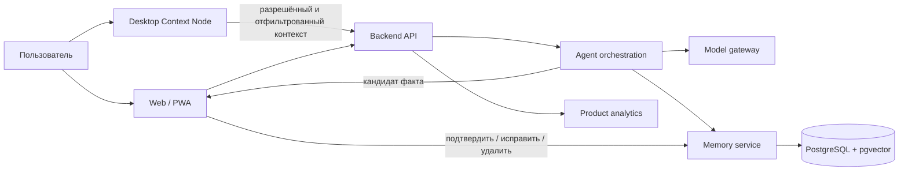

# Архитектура MVP

Документ фиксирует целевые границы. Реализованный код не обязан содержать пустой scaffold каждой границы.

## Компоненты

## Границы ответственности

### Web / PWA

Онбординг, текущие действия, рекомендации, проекты, память, подтверждение выводов и настройки согласий. Реализованные slices — интро и необязательное подтверждение профессиональных профилей. Поиск профилей пока работает через синтетический mock за provider-neutral контрактом и не импортирует данные.

### Desktop Context Node

Будущий Tauri 2 клиент для macOS и Windows. Собирает только явно разрешённые метаданные активного приложения/окна и контент, переданный пользователем через файл, текст или voice capture. Секреты хранятся в системном secure storage; локальное состояние — SQLite. Постоянная запись экрана не входит в MVP.

### Backend API

Аутентификация, авторизация, orchestration use cases и realtime delivery. Контроллеры только валидируют транспорт и вызывают бизнес-сервисы.

### Memory service

Хранит задачи, проекты, обязательства, навыки, достижения, evidence и связи с источниками. Значимый inferred fact проходит состояние `candidate -> confirmed|rejected`; сохранение в подтверждённую память без решения пользователя запрещено.

### Agent orchestration и model gateway

Agent loop определяет состояние и next best action. Gateway унифицирует structured output, embeddings, tool calling, latency/cost telemetry и provider errors для GigaChat и других моделей. Доменные сервисы не импортируют SDK конкретного провайдера.

### Analytics

События должны измерять реальные пользовательские действия и позволять исключить внутренний трафик. На первом рыночном тесте приоритетны activation, DAU, meaningful actions per DAU, action acceptance/completion, confirmation rate и retention.

## Развёртывание по этапам

1. Web onboarding и ручная/явная передача контекста.
2. Минимальный backend, auth, memory candidates и analytics.
3. Model gateway и один end-to-end next-action сценарий.
4. Desktop Context Node после проверки ценности web-цикла.
5. Новые интеграции только по данным интервью и использования.

## Сквозные требования

- отдельная конфигурация development/test/production;
- шифрование транспорта и чувствительных данных;
- аудит происхождения каждого факта памяти;
- экспорт, исправление и удаление пользовательских данных;
- идемпотентность фоновых задач и наблюдаемая обработка ошибок;
- отдельные adapters/services для blockchain parsing;
- mainnet и testnet никогда не используют общие адреса или окружение.
