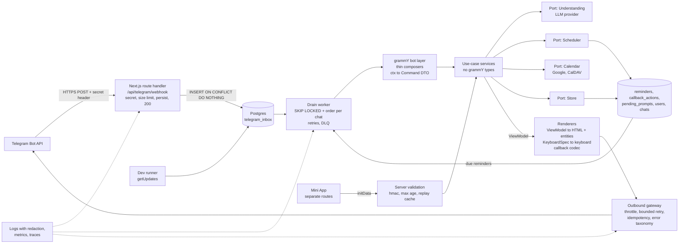
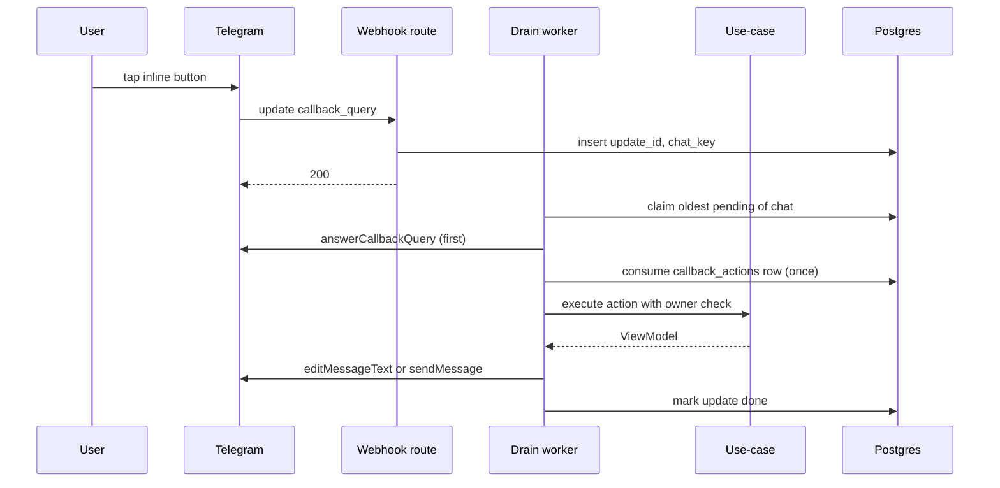

# Telegram-паттерны для «Стези»: разбор open-source ботов и фреймворков

Дата исследования: 2026-09-26. Статус: research-документ (не ADR, не обязательство по срокам). Документ дополняет `docs/decisions/0002-telegram-interaction-layer.md` и ничего в нём не отменяет: там, где выводы расходятся с ADR, это явно помечено в разделе 7.

Условные обозначения:

- **Факт (наблюдается в репозитории X)** — то, что я прочитал в исходниках/документации на указанную дату; рядом ссылка на конкретный файл. SHA клонов перечислены в разделе 11, чтобы наблюдение можно было воспроизвести.
- **Факт (проверено локально)** — короткий эксперимент, который я запустил сам на Node 20.20 (список — в разделе 2).
- **Предположение команды** — моя рекомендация или гипотеза, которую нужно подтвердить ADR, спайком или ручной проверкой на реальных клиентах Telegram.

---

## 1. Краткое резюме

Что стоит запомнить из всего исследования:

1. **Фреймворк — grammY** (1.46.0, Bot API 10.3, push 2026-08-26). Он уже стоит в `package.json`, покрывает актуальный Bot API, имеет адаптер `std/http`, который я проверил на Request/Response (годится для Next.js App Router), и набор плагинов. Telegraf де-факто в режиме поддержки и заявляет Bot API 7.1; GramIO современен, но экосистема заметно меньше (296 звёзд против 3756 у grammY). Подробности — раздел 9.
2. **Webhook должен подтверждать (200) только после durable-записи апдейта**, а не после обработки. Так делает самый серьёзный из изученных проектов (`openclaw/openclaw`, `extensions/telegram/src/webhook.ts`), и именно это советует документация grammY (очередь вместо длинной обработки в окне webhook).
3. **`webhookCallback` из grammY по умолчанию ждёт всю обработку и падает по таймауту 10 с**; `secretToken` в нём опционален (без него принимает всё). Для агента с LLM-вызовами это прямой путь к повторным доставкам и дублям. Нужен собственный тонкий route handler + inbox.
4. **`sequentialize` из runner работает только внутри одного процесса** (in-memory `Map`), а сам runner, по словам документации grammY, не гарантирует ни at-least-once, ни at-most-once. Порядок по чату в многоинстансной/serverless-среде нужно обеспечивать в БД (блокировка/FIFO по ключу чата).
5. **Дедуп по `update_id` — по множеству, а не по «максимальному виденному»**: Telegram может выбрать новый `update_id` случайно после недели без апдейтов (Bot API, описание `update_id`).
6. **callback_data**: лимит 1–64 **байта**. Популярная библиотека `deptyped/callback-data` проверяет `.length` (символы, а не байты), поэтому русский текст проходит проверку и отвергается Telegram. Нужен собственный кодек с `Buffer.byteLength`, версией и серверным хранилищем для больших/чувствительных payload.
7. **`@grammyjs/auto-retry` по умолчанию повторяет бесконечно** (`maxRetryAttempts` и `maxDelaySeconds` = Infinity) и повторяет запросы после сетевой ошибки, то есть может продублировать сообщение, которое уже доставлено. Лимиты и `rethrowHttpErrors` для неидемпотентных отправок надо задавать явно; `openclaw` разбирает это как отдельный класс ошибок (`isSafeToRetrySendError`).
8. **Время**: в Bot API нет часового пояса пользователя, но с Bot API 9.5 (2026-03-01) есть сущность `date_time` / `<tg-time>`, которую клиент рендерит в локальном поясе читателя. Для планировщика это лучший способ показывать «когда» в группах с людьми из разных поясов. Хранить всё равно нужно UTC-инстант + IANA-пояс пользователя.
9. **Стриминг ответов LLM**: с Bot API 9.5 `sendMessageDraft` доступен всем ботам (только личные чаты, черновик живёт ~30 с, финал нужно отправить обычным `sendMessage`). Edit-in-place с тротлингом ≥1 с — запасной вариант.
10. **Риск платформы**: Node 20 (в `engines` репозитория) вышел из поддержки 2026-04-30. `pg-boss` ≥ 11, `graphile-worker` 0.18 и `@sentry/node` 11 требуют более новый Node. Это надо решить до выбора очереди (раздел 4.2).

Документ завершают четыре блока: референсная архитектура (mermaid) — раздел 8; сравнение фреймворков — раздел 9; ранжированный список из 20 практик — раздел 10; список изученных репозиториев со звёздами и датой последнего push — раздел 11.

---

## 2. Метод и ограничения

- Звёзды и даты push получены через `gh api repos/...` 2026-09-26. Версии пакетов — через `npm view` / PyPI JSON в тот же день.
- Исходники читались из shallow-клонов (`git clone --depth 1`) в рабочей директории агента; для `openclaw/openclaw` использован sparse-checkout (`extensions/telegram`, `docs`).
- Документация grammY получена через Context7 (`/grammyjs/website`, `/grammyjs/conversations`) и `grammy.dev`. Bot API — с `core.telegram.org/bots/api` (версия 10.3, 2026-08-24), changelog, FAQ и «Bot features».
- Живой бот и реальные клиенты Telegram **не использовались**: всё, что касается визуального рендера (`date_time`, expandable blockquote, drafts) — вывод из документации и типов, а не наблюдение на устройстве.
- GitHub Search API упёрся в лимит на середине работы; поиск по CalDAV/Яндекс.Календарю дал только мелкие или заброшенные репозитории (список в 4.12), это следует читать как «зрелых open-source примеров не нашёл», а не как «их нет».
- Локальные эксперименты:
  - **E1.** grammY 1.46.0, `webhookCallback(bot, "std/http", { secretToken })`, вызов с `Request`: без заголовка секрета — 401, с неверным — 401, с верным — 200 и обработчик отработал; при `webhookCallback(bot, "std/http")` без `secretToken` запрос без заголовка принимается (200).
  - **E2.** `Intl.PluralRules("ru")`: 1→one, 2→few, 5→many, 21→one, 22→few; `Intl.DateTimeFormat("ru-RU", { timeZone })` и `Intl.RelativeTimeFormat("ru")` работают на Node 20.20; строка `Задача:12:abc` — 13 символов, но 19 байт.
- В первичных источниках Telegram есть расхождение: FAQ называет порог платных рассылок «100 000 Stars и 100 000 MAU», раздел Bot API — «10 000 Stars». Для нас неактуально (масштаб далёк), но цитировать порог нельзя.

---

## 3. Что изменилось в Bot API (9.3 → 10.3) и почему это важно для планировщика

Источник: [Bot API changelog](https://core.telegram.org/bots/api-changelog) и [Bot API](https://core.telegram.org/bots/api), снято 2026-09-26.

| Версия (дата) | Что добавлено | Чем полезно «Стезе» |
|---|---|---|
| 9.3 (2025-12-31) | `sendMessageDraft`; топики в личных чатах (`message_thread_id`, `has_topics_enabled`) | Стриминг ответа; отдельные «ветки» под проекты/задачи в ЛС с ботом |
| 9.4 (2026-02-09) | Custom emoji в сообщениях бота (если у владельца бота Premium); `icon_custom_emoji_id` и `style` у кнопок; `createForumTopic` в ЛС | Оформление карточек (опционально, нужен fallback-эмодзи) |
| 9.5 (2026-03-01) | Сущность `date_time` (`<tg-time>`); `sendMessageDraft` доступен всем ботам | Время в локальном поясе читателя; стриминг без особых прав |
| 10.0 (2026-05-08) | Guest mode (бот отвечает в чатах, где он не участник); реакции; polls | Вызов агента через @упоминание в любой группе без добавления бота |
| 10.1 (2026-06-11) | Rich messages (`sendRichMessage`, до 32768 символов, блоки, таблицы, сворачиваемые блоки) | Длинные расписания/отчёты одним сообщением |
| 10.2 (2026-07-14) | Ephemeral-сообщения (видны только одному участнику группы, доставка не гарантируется) | «Тихие» ответы в группе, не засоряя её |
| 10.3 (2026-08-24) | `DisabledButton` (`disabled` у inline-кнопки), `force_reply` в `InlineKeyboardMarkup`, `can_stop`/`keep_on_stop` у draft, update `stopped_message_generation`, expandable-цитаты в rich messages | Защита от double-tap, кнопка «Остановить» при стриминге |

**Факт (наблюдается в grammyjs/grammY):** README заявляет Bot API 10.3, в `src/bot.ts` `DEFAULT_UPDATE_TYPES` уже содержит `guest_message` и `stopped_message_generation`, а типы `@grammyjs/types@5.0.0` (2026-08-25) описывают `sendMessageDraft`, `sendRichMessage`, `date_time`. Ссылки: [README](https://github.com/grammyjs/grammY/blob/main/README.md), [src/bot.ts](https://github.com/grammyjs/grammY/blob/main/src/bot.ts).

**Факт (Bot API, «Bot features»):** в группах при включённом privacy mode бот видит только: команды, адресованные ему (`/cmd@bot`), общие команды, если он последним писал в группу, inline-сообщения через него и ответы на сообщения, явно или неявно адресованные боту; сервисные сообщения и весь личный чат — всегда. Администратор видит всё. Официальная рекомендация: если возможно, обходиться `force_reply`, а не отключать privacy mode ([features](https://core.telegram.org/bots/features)).

---

## 4. Разбор по темам

### 4.1. Структура проекта и слои

**Что делают изученные проекты.**

- **Факт (наблюдается в bot-base/telegram-bot-template):** `src/bot/{features,handlers,middlewares,keyboards,callback-data,filters,helpers}`, отдельный `src/server` (Hono), зависимости (`config`, `logger`) передаются в `createBot(token, deps)`, каждая «фича» — `Composer`, `unhandled` подключён последним. Ссылки: [src/bot/index.ts](https://github.com/bot-base/telegram-bot-template/blob/main/src/bot/index.ts), [src/server/index.ts](https://github.com/bot-base/telegram-bot-template/blob/main/src/server/index.ts). Слоя use-case/сервисов нет: обработчики работают с `ctx` напрямую (для шаблона это нормально, для нас — нет).
- **Факт (наблюдается в wakaree/aiogram_bot_template):** самый близкий к нужной нам чистой архитектуре шаблон: `app/domain`, `app/application/{ports,interactors,errors}`, `app/infrastructure`, `app/presentation/telegram/{handlers,flows,presenters,keyboards,view}`. Обработчик `my_chat_member` вызывает `PMFlow.mark_blocked()`, тот — `PMInteractor.mark_blocked()`, который пишет `blocked_at` в пользователя через порт `UsersGateway`. Ссылки: [handlers/extra/pm.py](https://github.com/wakaree/aiogram_bot_template/blob/main/app/presentation/telegram/handlers/extra/pm.py), [interactors/pm/user_status.py](https://github.com/wakaree/aiogram_bot_template/blob/main/app/application/interactors/pm/user_status.py).
- **Факт (там же):** паттерн «view model → renderer»: `View` (`text`, `reply_markup`, `mode`, `edit`, `reply`, `delete`, `message_id`) и `RenderMode = ANSWER | NEW | NONE`; `Renderer.apply(view)` решает, редактировать текущее сообщение или отправить новое. Ссылки: [view/models.py](https://github.com/wakaree/aiogram_bot_template/blob/main/app/presentation/telegram/view/models.py), [view/renderer.py](https://github.com/wakaree/aiogram_bot_template/blob/main/app/presentation/telegram/view/renderer.py). Недостаток: в `View` лежит `InlineKeyboardMarkup` из aiogram, то есть тип Telegram протекает в «модель представления».
- **Факт (наблюдается в openclaw/openclaw):** решение «реагировать ли в группе» вынесено в чистую функцию с явными входами: `resolveInboundMentionDecision({ facts: { canDetectMention, wasMentioned, hasAnyMention, implicitMentionKinds }, policy: { isGroup, requireMention, ... } })`; `reply_to_bot` считается неявным упоминанием. Ссылка: [bot-message-context.body.ts](https://github.com/openclaw/openclaw/blob/main/extensions/telegram/src/bot-message-context.body.ts).
- **Факт (наблюдается в grinev/opencode-telegram-bot):** каталоги `src/app/{services,managers,stores,types,formatters}` и `src/bot/{callbacks,commands,handlers,menus,messages,keyboards}` — прикладная логика отделена от grammY-слоя, форматтеры лежат в `app`. Ссылка: [src/](https://github.com/grinev/opencode-telegram-bot/tree/main/src).

**Рекомендация.**

- **Предположение команды:** держать ADR 0002 как есть (grammY только в `bot/` и `handlers/`, домен и рендер без типов grammY) и добавить три механических гарантии: (а) правило ESLint `no-restricted-imports` (или `eslint-plugin-boundaries`, конфиг-пример: [`.eslint/boundaries/node.eslint.mjs`](https://github.com/DrSmile444/grammy-testing/blob/main/.eslint/boundaries/node.eslint.mjs)) — импорт `grammy` и `@grammyjs/*` запрещён вне `bot/`, `handlers/`, `transport/`; (б) ViewModel и `KeyboardSpec` — простые данные (`{ label, action }`), которые в `InlineKeyboard` превращает только renderer; (в) политики вроде «отвечать ли в группе», «показывать ли кнопку» — чистые функции с входными «фактами», как `resolveInboundMentionDecision`.
- Обработчик grammY делает три вещи: нормализует `ctx` в команду/интент (DTO без grammY), вызывает use-case, передаёт результат в renderer. Никакой бизнес-логики и строк сообщений в обработчике.

### 4.2. Приём апдейтов: webhook, polling, ACK, идемпотентность, порядок, повторы

#### Что говорит платформа

- **Факт (Bot API, `setWebhook`):** на неуспешный ответ (не 2xx) Telegram повторяет доставку «разумное число раз» и затем сдаётся; `secret_token` 1–256 символов из `A-Za-z0-9_-` приходит в заголовке `X-Telegram-Bot-Api-Secret-Token`; `max_connections` 1–100 (по умолчанию 40); `allowed_updates` по умолчанию исключает `chat_member`, `message_reaction`, `message_reaction_count`; порты 443/80/88/8443; пока установлен webhook, `getUpdates` недоступен.
- **Факт (Bot API, `update_id`):** идентификатор растёт последовательно, позволяет игнорировать повторы и восстанавливать порядок; если новых апдейтов не было неделю, следующий `update_id` выбирается **случайно**.
- **Факт (grammy.dev, [deployment-types](https://grammy.dev/guide/deployment-types)):** при таймауте webhook Telegram присылает тот же апдейт повторно; для долгих операций советуют очередь. Webhook-reply (ответ прямо в теле HTTP-ответа) лишает обработки ошибок и отмены — «использовать редко». [reliability](https://grammy.dev/advanced/reliability): встроенный long polling — «at least once» (до 100 уже виденных апдейтов могут прийти повторно), runner — ни at-least-once, ни at-most-once; для webhooks дедуп по `update_id` — на вашей стороне.

#### Что делает `webhookCallback` в grammY 1.46.0

**Факт (наблюдается в grammyjs/grammY, [convenience/webhook.ts](https://github.com/grammyjs/grammY/blob/main/src/convenience/webhook.ts)):**

- обработчик `await`-ит `bot.handleUpdate(...)` целиком, затем отвечает; при превышении `timeoutMilliseconds` (по умолчанию 10 000) с `onTimeout: "throw"` выбрасывает ошибку — Telegram увидит не-2xx и повторит апдейт, а обработка при этом продолжается;
- `secretToken` опционален: `if (token === undefined) return true` — без токена принимается любой запрос (проверено в E1);
- сравнение секрета выполнено в постоянное время;
- список адаптеров в [convenience/frameworks.ts](https://github.com/grammyjs/grammY/blob/main/src/convenience/frameworks.ts): `aws-lambda`, `aws-lambda-async`, `azure`, `azure-v4`, `bun`, `cloudflare`, `cloudflare-mod`, `elysia`, `express`, `fastify`, `hono`, `http`, `https`, `koa`, `next-js`, `nhttp`, `oak`, `serveHttp`, `std/http`, `sveltekit`, `worktop`.
- адаптер `next-js` написан под Pages-API (`request.body`, `response.status(200).json`) — для App Router route handler он не подходит; подходит `std/http` (Request → Response), это подтверждено в E1. Официальная страница про Vercel ([grammy.dev/hosting/vercel](https://grammy.dev/hosting/vercel)) описывает только Serverless Functions в `api/` и `webhookCallback(bot, "https")` с `maxDuration: 10`; App Router в ней не упомянут.

#### Как поступают проекты, где потеря апдейта недопустима

- **Факт (наблюдается в openclaw/openclaw, [webhook.ts](https://github.com/openclaw/openclaw/blob/main/extensions/telegram/src/webhook.ts), [docs/channels/telegram/transports.md](https://github.com/openclaw/openclaw/blob/main/docs/channels/telegram/transports.md)):**
  - webhook-режим **отказывается стартовать без непустого секрета** (исключение «requires a non-empty secret token»);
  - неверные секреты ограничиваются по частоте **до чтения тела**; лимит тела 1 МиБ, таймаут чтения тела 30 с, ответы 413/408/400;
  - «Telegram видит 200 только после того, как апдейт durable»: `ingressMonitor.admit(body.value)` пишет в SQLite-очередь; при ошибке записи отвечает не-200, чтобы Telegram доставил повторно; повторно присланный `update_id` попадает в ту же строку очереди (дедуп на входе) и тоже быстро получает 200;
  - обработка идёт отдельным drain-ом по «полосам» (lanes) на чат/топик, ACK не ждёт ход агента;
  - отдельные зарезервированные пути для проб (`/healthz`, `/readyz` и др.);
  - документ честно называет гарантию: «bounded replay deduplication, not exactly-once», после сбоя между побочным эффектом и завершением строки эффект может повториться.
- **Факт (наблюдается в openclaw/openclaw, [bot-update-tracker.ts](https://github.com/openclaw/openclaw/blob/main/extensions/telegram/src/bot-update-tracker.ts), [bot-updates.ts](https://github.com/openclaw/openclaw/blob/main/extensions/telegram/src/bot-updates.ts)):** принятые `update_id` отслеживаются **по идентификаторам, а не глобальной «верхней отметкой»**, потому что несколько полос могут завершать новые id раньше старого; помимо числового id есть «семантические» ключи (`update:<id>`, `callback:<id>`, `edited-message:<chat>:<msg>`, `message:<chat>:<msg>`); краткосрочный кэш дедупа — TTL 5 минут, 2000 записей; хвост завершённых/упавших строк хранится до 30 суток, до 1000 записей на класс.
- **Факт (наблюдается в gramiojs/gramio, [src/webhook/index.ts](https://github.com/gramiojs/gramio/blob/main/src/webhook/index.ts)):** по умолчанию апдейт кладётся в **in-memory** очередь `bot.updates.queue.add(...)` и сразу отвечается 200 (в коде оставлен комментарий `TODO: more think about queue based or wait in handler update`); есть опция `shouldWait` (ждать обработку, таймаут по умолчанию 30 с). Сравнение секрета: `header !== secretToken` (не постоянное время). На serverless-платформе, замораживающей процесс после ответа, такая схема теряет апдейты.
- **Факт (наблюдается в aiogram/aiogram, [aiogram/webhook/aiohttp_server.py](https://github.com/aiogram/aiogram/blob/dev-3.x/aiogram/webhook/aiohttp_server.py)):** `handle_in_background` — «сразу ответить Telegram, обработать фоновой задачей» (тоже in-memory), `secrets.compare_digest` для секрета.
- **Факт (наблюдается в ofershap/telegram-calendar-bot, [src/index.ts](https://github.com/ofershap/telegram-calendar-bot/blob/main/src/index.ts)):** Cloudflare Worker: `POST /webhook` без проверки `secret_token`, без дедупа, синхронно ждёт обработку (LLM + Google Calendar) и только потом отвечает `{ok:true}` — в сочетании с повторами Telegram это даёт дубли событий календаря.

#### Способы «ответить быстро» — сравнение

| Вариант | Долговечность | Порядок по чату | Где работает | Замечания |
|---|---|---|---|---|
| Обработка внутри `webhookCallback` (по умолчанию) | нет: обрыв = повтор Telegram | нет | везде | таймаут 10 с; LLM-вызовы не помещаются |
| `after()` из `next/server` | нет: работа «после ответа» ограничена `maxDuration` маршрута и жизнью процесса | нет | Next 15+/16; на serverless нужен `waitUntil` платформы | [документация Next.js](https://nextjs.org/docs/app/api-reference/functions/after) через Context7 (v16.2.9): `after` выполняется в пределах максимальной длительности маршрута, для serverless нужен примитив `waitUntil` |
| Inbox-таблица в Postgres + собственный drain (`FOR UPDATE SKIP LOCKED`) | да | реализуется предикатом «нет более раннего необработанного апдейта этого чата» | там, где есть долгоживущий воркер или cron-вызов | нет новых зависимостей; требует ADR (второй процесс, см. ADR 0002) |
| `pg-boss` | да (Postgres, `SKIP LOCKED`) | политика очереди `key_strict_fifo` (FIFO по `singletonKey`), `groupConcurrency`, `deadLetter`, `singletonKey`/`singletonSeconds` для дедупа, cron/RRULE с `tz` | [документация master](https://github.com/timgit/pg-boss/tree/master/docs/api): `queues.md`, `workers.md`, `scheduling.md` | v12.35.0 требует **Node ≥ 22.12**, v11 — Node ≥ 22, **v10.4.2 — Node ≥ 20**; доступность `key_strict_fifo` в 10.x я не проверял |
| `graphile-worker` | да (Postgres) | по именованным очередям | Node | 0.18.0 требует **Node ≥ 22.18**, 0.17.3 — Node ≥ 14 |
| BullMQ 6.3.9 | да (Redis) | группы — не проверял | Node ≥ 14 | новая инфраструктура (Redis) |
| Hatchet (используется в `remoodle/heresy`) | да | — | нужен отдельный сервер Hatchet | самый тяжёлый вариант, для нашего масштаба избыточен |

**Рекомендация (Предположение команды).**

1. Route handler `src/app/api/telegram/webhook/route.ts` остаётся тонким: постоянное сравнение секрета (пустой секрет в конфигурации — ошибка запуска, как в `openclaw`), лимит тела, проверка формы (`update_id` — целое), `INSERT ... ON CONFLICT (update_id) DO NOTHING`, ответ 200; при любой ошибке записи — 5xx.
2. Дальнейшая обработка — отдельным drain-ом: собственная таблица + `SKIP LOCKED` на первом этапе или `pg-boss` после перехода на Node 22 (см. 4.2 «Node»). Решение о втором процессе фиксируется новым ADR (это прямо предусмотрено ADR 0002).
3. Для вызова grammY из воркера использовать публичный `bot.handleUpdate(update)` и передавать `botInfo` в конструктор, чтобы не делать `getMe` на холодном старте (в E1 бот создавался с `botInfo`).
4. Dev-режим: long polling через `@grammyjs/runner` с `sequentialize` (как в [main.ts](https://github.com/bot-base/telegram-bot-template/blob/main/src/main.ts) шаблона: `deleteWebhook`, `run(bot, { runner: { fetch: { allowed_updates } } })`, остановка по `SIGINT/SIGTERM`), но **апдейты из polling тоже кладутся в inbox**, чтобы dev и prod проходили один путь.

#### Идемпотентность

- Дедуп на входе: `update_id` — первичный ключ inbox; хранить строки не менее недели (учитывая правило случайного нового `update_id`), сравнивать по множеству, а не по `> last_update_id`.
- Дедуп побочных эффектов — отдельно и по бизнес-ключу: **Факт (наблюдается в remoodle/heresy, [schedule-reminder-check-user.ts](https://github.com/remoodle/heresy/blob/trunk/apps/remoodle/src/worker/workflows/schedule-reminder-check-user.ts)):** таблица `sent_notifications` с `eventId = "sched:<id занятия>:<дата>"`, перед отправкой берутся уже отправленные id пользователя и вычитаются. Это защищает напоминания от повторного запуска cron. Недостаток: проверка «прочитать множество → отправить → записать» не атомарна без уникального индекса (**Предположение команды:** делать `INSERT ... ON CONFLICT DO NOTHING RETURNING` как «захват права на отправку», затем отправка, затем пометка).
- **Факт (наблюдается в grammy-emulate / grinev/opencode-telegram-bot):** для проверки «повтор не дублирует сообщение» нужен сценарий «Telegram выполнил запрос, а ответ до бота не дошёл» (`deliver-then-drop`) — см. 4.11.

#### Порядок по чату

- **Факт (наблюдается в grammyjs/runner, [src/sequentialize.ts](https://github.com/grammyjs/runner/blob/main/src/sequentialize.ts)):** `sequentialize` — `Map<string, {chain, len}>` внутри процесса; принимает функцию-ограничитель, может вернуть массив ключей (например чат и пользователь). Документация grammY ([scaling](https://github.com/grammyjs/website/blob/main/site/docs/advanced/scaling.md)) называет причину: write-after-read гонка сессий при конкурентной обработке.
- **Факт (наблюдается в aiogram/aiogram, [fsm/storage/redis.py](https://github.com/aiogram/aiogram/blob/dev-3.x/aiogram/fsm/storage/redis.py), [fsm/strategy.py](https://github.com/aiogram/aiogram/blob/dev-3.x/aiogram/fsm/strategy.py)):** `RedisEventIsolation` — распределённая блокировка на ключ (`lock`), а ключ состояния FSM строится стратегией `USER_IN_CHAT | CHAT | GLOBAL_USER | USER_IN_TOPIC | CHAT_TOPIC`. Это межпроцессный аналог `sequentialize`.
- **Факт (наблюдается в python-telegram-bot/python-telegram-bot):** `max_concurrent_updates=1` по умолчанию (`_applicationbuilder.py`) — обработка последовательна, пока не включить конкурентность.
- **Факт (наблюдается в openclaw/openclaw, [sequential-key.ts](https://github.com/openclaw/openclaw/blob/main/extensions/telegram/src/sequential-key.ts)):** ключ последовательности строится из чата/топика, а «control lane» пропускает управляющие команды (остановить, статус, одобрить), которые **не должны стоять в очереди за длинным ходом агента**.
- **Предположение команды:** ключ порядка — `chat_id` (+ `message_thread_id` в топиках); callback-и того же сообщения используют тот же ключ; кнопки/команды «Отмена» и «Стоп» получают отдельную полосу, чтобы не ждать окончания 30-секундного вызова LLM.

#### Повторы и «отравленные» апдейты

- Telegram повторяет только пока мы отвечаем не-2xx. Если апдейт уже сохранён, ответ всегда 200, а повторы — забота воркера: счётчик попыток, экспоненциальная пауза с джиттером (как `computeBackoff({initialMs:250,maxMs:5000,factor:2,jitter:0.2})` в [telegram-ingress-spool.ts](https://github.com/openclaw/openclaw/blob/main/extensions/telegram/src/telegram-ingress-spool.ts)), после N неудач — статус `failed`, один раз сообщить пользователю по-человечески и создать алерт. Отравленный апдейт не должен блокировать очередь чата навсегда.

#### Прочее по webhook

- **Предположение команды:** `setWebhook` вызывается скриптом при деплое (а не на каждом холодном старте serverless): явные `allowed_updates` = `message`, `edited_message`, `callback_query`, `my_chat_member`, `inline_query`, при необходимости `guest_message`, `stopped_message_generation`; сниженный `max_connections` (например 10–20), чтобы ограничить нагрузку на БД. `openclaw` ([allowed-updates.ts](https://github.com/openclaw/openclaw/blob/main/extensions/telegram/src/allowed-updates.ts)) сознательно **исключает** `stopped_message_generation`: подписка без обработчика подтверждала бы нажатие «Стоп» без видимого результата — то же правило для нас.
- `getWebhookInfo` (`pending_update_count`, `last_error_date`, `last_error_message`) — готовый источник алерта «webhook сломан» в health-проверке.
- Порядок запуска: сначала готовность приложения (`bot.init()`), затем приём; в `main.ts` шаблона `bot.init()` вызывается до старта сервера «чтобы не получать апдейты, пока бот не готов».
- **Node.** Node 20 закрыт 2026-04-30, Node 22 — до 2027-04-30, Node 24 — до 2028-04-30 ([nodejs/Release schedule.json](https://github.com/nodejs/Release/blob/main/schedule.json)). В `package.json` репозитория `engines.node = ">=20.9.0 <21"`; `@sentry/node@11.0.0` требует `>=20.19`, `pg-boss@12` — `>=22.12`. **Предположение команды:** отдельной задачей поднять Node до 22 LTS (или 24) до принятия решения об очереди.

### 4.3. callback_data: схема, версии, серверные токены, устаревшие кнопки

**Факты о платформе.** `callback_data` — 1–64 **байта** ([Bot API](https://core.telegram.org/bots/api), `InlineKeyboardButton`); `answerCallbackQuery` — уведомление до 200 символов, `show_alert`, `cache_time`; без ответа клиент продолжает показывать «загрузку». С 10.3 у inline-кнопки есть `disabled`.

**Факты из кода.**

| Проект | Как устроено | Вывод |
|---|---|---|
| openclaw ([approval-callback-data.ts](https://github.com/openclaw/openclaw/blob/main/extensions/telegram/src/approval-callback-data.ts), [native-command-callback-data.ts](https://github.com/openclaw/openclaw/blob/main/extensions/telegram/src/native-command-callback-data.ts)) | Версионированные префиксы `tga1:`, `tgcmd:`, `tgcb1:`; проверка `Buffer.byteLength(value,"utf8") <= 64`; если не влезает — вместо полного id кладётся короткая ссылка-дайджест, авторизация проверяется на сервере; для «непрозрачных» значений добавлена контрольная сумма FNV-1a (5 символов) | Версия в префиксе + байтовая проверка + серверная ссылка для длинного |
| aiogram ([filters/callback_data.py](https://github.com/aiogram/aiogram/blob/dev-3.x/aiogram/filters/callback_data.py)) | Класс-фабрика `CallbackData` с префиксом и разделителем; `pack()` бросает `ValueError`, если `len(encoded) > 64` **в байтах**; разделитель запрещён в значениях | Типизированная фабрика с жёстким отказом при переполнении |
| python-telegram-bot ([_callbackdatacache.py](https://github.com/python-telegram-bot/python-telegram-bot/blob/master/src/telegram/ext/_callbackdatacache.py)) | «Arbitrary callback data»: в кнопку кладётся UUID, объект живёт в LRU-кэше (по умолчанию `maxsize=1024`), при промахе — исключение `InvalidCallbackData` | Явная обработка «кнопка устарела»; но кэш в памяти процесса — для нескольких инстансов нужно хранилище |
| grammY menu ([src/menu.ts](https://github.com/grammyjs/menu/blob/main/src/menu.ts)) | `callback_data = "<id>/<row>/<col>/<payload>/" + хэш`, отпечаток (`fingerprint`) раскладки; при несовпадении вызывается `onMenuOutdated` (по умолчанию текст «Menu was outdated, try again!») | Готовая проверка «меню устарело» — но непрозрачный формат |
| bot-base template ([callback-data/change-language.ts](https://github.com/bot-base/telegram-bot-template/blob/main/src/bot/callback-data/change-language.ts)) | Использует `createCallbackData` из пакета `callback-data` | См. следующую строку |
| deptyped/callback-data ([src/callback-data.ts](https://github.com/deptyped/callback-data/blob/main/src/callback-data.ts)) | `const CALLBACK_DATA_SIZE_LIMIT = 64` и проверка `packedData.length > CALLBACK_DATA_SIZE_LIMIT` — считает **символы UTF-16**, не байты; последний push 2023-09-18, v1.1.1 | **Риск**: значение на кириллице `Задача:12:abc` — 13 символов, но 19 байт (E2). Библиотека пропустит, Telegram отвергнет |
| gramiojs/callback-data ([src/index.ts](https://github.com/gramiojs/callback-data/blob/main/src/index.ts)) | Идентификатор из 6 символов (SHA-1 от имени схемы) + компактный сериализатор; явной проверки 64 байт в `index.ts` я не нашёл | Проверку размера нужно делать снаружи |
| opencode-telegram-bot ([callbacks/callback-router.ts](https://github.com/grinev/opencode-telegram-bot/blob/main/src/bot/callbacks/callback-router.ts)) | Роутер по префиксу до `:`; неизвестный префикс → `answerCallbackQuery` с текстом «неизвестная команда»; ошибка обработчика → сброс состояния взаимодействия и ответ | Единая точка ответа на любой callback; но см. анти-паттерн с проглоченной ошибкой в разделе 7 |

**Рекомендация (Предположение команды; ADR 0002 п. 5 уже требует «версионированный, проверяемый по размеру кодек с серверным поиском»).**

- Формат: `<версия><тип>:<аргументы>`, например `1a:<token>`; версия — часть первой цифры, чтобы старые кнопки в чатах распознавались как «версия N, обработчика нет» и получали явный ответ, а не молча игнорировались.
- Малые stateless-действия (`страница 3`, `следующий день`) — прямо в данных. Всё, что содержит идентификаторы сущностей, пользовательский текст, или что нельзя повторять, — **непрозрачный токен** (8–12 символов base64url) → строка в `callback_actions` (`id`, `chat_id`, `owner_user_id`, `message_id`, `kind`, `payload jsonb`, `expires_at`, `consumed_at`, `version`).
- Кодек **бросает ошибку** при `Buffer.byteLength(data) > 64` в момент построения клавиатуры (сбой видим на этапе разработки, а не у пользователя). Тест на русских значениях обязателен.
- Подпись HMAC обычно не нужна: запросы к боту аутентифицированы `secret_token`, подделать `callback_data` у пользователя нельзя; реальные угрозы — устаревшая кнопка, повторное нажатие и **нажатие не тем пользователем** (в группе кнопку видят все). Поэтому серверный токен всегда проверяет `callback_query.from.id` против владельца (или правило «любой участник» — осознанно).
- **Двойное нажатие**: (1) сразу `answerCallbackQuery` (первый же шаг обработчика, до любой работы); (2) атомарное «потребление» токена `UPDATE ... SET consumed_at = now() WHERE id = $1 AND consumed_at IS NULL RETURNING ...`; повторное нажатие получает `answerCallbackQuery` с текстом «уже выполнено»; (3) клавиатуру заменить/убрать или сделать кнопки `disabled` (Bot API 10.3). Ошибка `message is not modified` при таком редактировании — ожидаемая и безвредная (`openclaw` выделяет её в `isTelegramMessageNotModifiedError`, [network-errors.ts](https://github.com/openclaw/openclaw/blob/main/extensions/telegram/src/network-errors.ts)).
- **Устаревшая кнопка**: токен не найден/просрочен → `answerCallbackQuery(show_alert)` с понятным текстом и, если можно, перерисовка актуальной карточки; молчаливое игнорирование запрещено правилами репозитория.
- **Редактировать или присылать новое.** Навигация, пагинация, подтверждение → редактирование исходного сообщения (в шаблоне aiogram это `RenderMode.ANSWER`: «править, если можно, иначе новое»). Асинхронные результаты и напоминания → новое сообщение, потому что правка не создаёт уведомления (**Предположение команды**, поведение клиентов проверить вручную). Если исходное сообщение править нельзя (удалено, не наше) — явно отправить новое и залогировать причину.

### 4.4. Богатый рендер сообщений

**HTML или MarkdownV2.**

- **Факт (Bot API, «Formatting options»):** в MarkdownV2 любой символ с кодом 1–126 можно экранировать `\`, а спецсимволы обязательны к экранированию; в HTML экранируются только `<`, `>`, `&` (и кавычки в атрибутах).
- **Факт (наблюдается в remoodle/heresy, [library/telegram-html.ts](https://github.com/remoodle/heresy/blob/trunk/apps/remoodle/src/library/telegram-html.ts)):** маленькие хелперы `bold/italic/code/link` с обязательным экранированием — самый простой безопасный подход.
- **Факт (наблюдается в bot-base/telegram-bot-template):** `bot.api.config.use(parseMode('HTML'))` — HTML включён глобально для всех вызовов; любой неэкранированный пользовательский текст даёт 400 «can't parse entities».
- **Факт (наблюдается в father-bot/chatgpt_telegram_bot, [bot/bot.py](https://github.com/father-bot/chatgpt_telegram_bot/blob/main/bot/bot.py)):** при любом `BadRequest`, кроме «Message is not modified» (определяется **сравнением строки** сообщения), правка повторяется **без `parse_mode`** — молчаливая деградация форматирования.
- **Рекомендация (Предположение команды):** HTML + типизированный построитель с обязательным `escapeHtml` для любого пользовательского фрагмента; глобальный `parseMode` не включать (формат задаёт renderer явно); для составления текста из пользовательских кусков использовать `fmt`/`FormattedString` из `@grammyjs/parse-mode` 2.3.0 (в нём есть `date_time`; [format.ts](https://github.com/grammyjs/parse-mode/blob/master/src/format.ts)); если Telegram отклонил разметку — это ошибка: логировать и показывать пользователю сообщение об ошибке, а не тихо переотправлять «голым» текстом (правило «без silent fallbacks»). Исключение — стриминг (см. ниже).

**Лимиты.** Текст сообщения — 1–4096 символов **после** разбора сущностей (Bot API), поэтому длину нужно считать по видимым символам, а не по длине HTML. **Факт (наблюдается в openclaw/openclaw, [format.ts](https://github.com/openclaw/openclaw/blob/main/extensions/telegram/src/format.ts)):** `countTelegramHtmlVisibleCharacters`, `splitTelegramHtmlChunks(html, limit)`. Новый вариант — `sendRichMessage` до 32768 символов и 500 блоков (Bot API 10.1) — **Предположение команды:** не применять, пока не проверена поддержка старыми клиентами и наличие рабочей деградации.

**Сущности и оформление.**

- Раскрываемая цитата: HTML `<blockquote expandable>`, MarkdownV2 — `**>` в начале блока; сущность `expandable_blockquote`. Подходит для «Подробности/описание» в карточках задач.
- Даты и время: `<tg-time unix="1647531900" format="wDT">вт, 22:45</tg-time>`; формат — регулярное выражение `r|w?[dD]?[tT]?` (`r` относительное время, `w` день недели, `d/D` дата коротко/полностью, `t/T` время коротко/полностью), клиент показывает в **локальном поясе и языке читателя**; при пустом формате текст показывается как есть. Введено в 9.5; `@grammyjs/parse-mode` 2.3.0 умеет `date_time`, а `HTMLStreamParser` разбирает `tg-time` и `blockquote expandable`. **Предположение команды:** текст внутри тега — форматированное время в сохранённом поясе пользователя (это и запасной вариант для клиентов без поддержки); проверить на iOS/Android/Desktop/Web.
- Предпросмотр ссылок: `link_preview_options: { is_disabled: true }` — **Факт (наблюдается в remoodle/heresy, [library/telegram.ts](https://github.com/remoodle/heresy/blob/trunk/apps/remoodle/src/library/telegram.ts)):** ставится в каждом `sendMessage`. **Предположение команды:** выключать по умолчанию в outbound-шлюзе, включать точечно.
- Message effects (`message_effect_id`, только личные чаты) и custom emoji — в изученных репозиториях примеров использования я не нашёл; **Предположение команды:** вне MVP; custom emoji (9.4) требует Premium у владельца бота и должно иметь обычный эмодзи в качестве запасного текста.
- Карточка задачи/слота: одна ViewModel `TaskCard` (заголовок, время, статус, действия) и один renderer; клавиатура — из `KeyboardSpec`. Действия: «Готово», «Перенести», «Удалить» (с подтверждением), «Открыть в календаре».

**Клавиатуры.** Плагин `@grammyjs/menu` (1.5.0) даёт отпечатки, навигацию, динамические диапазоны — хорош для статичных экранов настроек (язык, пояс); для карточек с собственным кодеком — ручной `InlineKeyboard` из `KeyboardSpec`, поскольку формат данных menu непрозрачен и плохо сочетается с серверными токенами. Пагинация — размер страницы до ~8 строк, номер страницы и версия среза в данных/токене, правка того же сообщения. Паттерн «одно сообщение, правится на месте»: и в шаблоне aiogram (`RenderMode.ANSWER`), и в `inline-menu.ts` у opencode-telegram-bot.

**Индикатор набора.** `sendChatAction` показывается до 5 секунд и снимается при отправке сообщения (Bot API). Для долгих ходов повторять примерно каждые 4 с (**Факт (наблюдается в openclaw/openclaw):** [chat-action-timing.ts](https://github.com/openclaw/openclaw/blob/main/extensions/telegram/src/chat-action-timing.ts), а также отдельный backoff при 401 для `sendChatAction`). Плагин `@grammyjs/auto-chat-action` (0.1.1, последний push 2024-05-06) делает это автоматически — годится, но проект не развивается.

**Стриминг ответа LLM.**

1. **Черновики `sendMessageDraft`** (Bot API 9.3/9.5). **Факт (типы `@grammyjs/types@5.0.0`, [methods.d.ts](https://www.npmjs.com/package/@grammyjs/types)):** только личный чат (`chat_id` — приватный), `draft_id` ненулевой, одинаковый `draft_id` даёт анимацию, пустой `text` показывает «Thinking…», `can_stop` добавляет кнопку остановки (тогда бот получит апдейт `stopped_message_generation`), «draft — временный предпросмотр на 30 секунд, по завершении необходимо вызвать `sendMessage`». **Предположение команды:** для ответов длиннее ~10 с периодически переотправлять черновик; финал — всегда обычное сообщение; в группах не использовать.
2. **Правка одного сообщения.** **Факт (наблюдается в openclaw/openclaw, [draft-stream.ts](https://github.com/openclaw/openclaw/blob/main/extensions/telegram/src/draft-stream.ts)):** тротлинг 1000 мс (минимум 250), после 3 подряд неудач превью останавливается, минимальное время показа превью 4 с, «Message is not modified» — не ошибка, текст длиннее лимита делится на страницы; при 429 «заменяемые» запросы (превью, набор) **уступают** и не встают в очередь, а «незаменяемые» (финальный ответ, удаление) ждут `retry_after` ([account-throttler.ts](https://github.com/openclaw/openclaw/blob/main/extensions/telegram/src/account-throttler.ts): 429 — штраф на весь токен бота, бюджет ожидания 5 минут). По умолчанию `openclaw` вообще не стримит текст ответа, а держит один «статусный» черновик и отправляет финал обычным сообщением ([messaging.md](https://github.com/openclaw/openclaw/blob/main/docs/channels/telegram/messaging.md)).
3. **Анти-пример.** father-bot правит сообщение при приросте ≥100 символов с `sleep(0.01)`, без учёта 429.
4. **Рекомендация (Предположение команды):** ответы планировщика — короткие и структурированные; стримить только свободный текст в ЛС; структурные карточки отправлять целиком. Частичный HTML/Markdown от LLM часто не закрыт — при правках использовать `HTMLStreamParser` из parse-mode (превращает частичный HTML в сущности) либо стримить простой текст, а форматировать только финал.

### 4.5. Диалоги и состояние

**Варианты.**

- **`@grammyjs/session`** (встроен в grammY, хранилища — `@grammyjs/storages`: bun, cloudflare, denokv, dynamodb, file, firestore, free, mongodb, pocketbase, prisma, **psql**, redis, s3, supabase, typeorm). Гонка «чтение-запись» лечится `sequentialize` с тем же ключом (документация scaling). **Факт:** bot-base template и remoodle используют `MemorySessionStorage` — состояние теряется при рестарте и не разделяется между инстансами.
- **`@grammyjs/conversations` 2.1.1** (push 2026-07-23). **Факт (grammy.dev/plugins/conversations, репозиторий [grammyjs/conversations](https://github.com/grammyjs/conversations)):** это replay-движок — функция диалога при каждом апдейте выполняется заново с начала, а вызовы API пропускаются до прежней точки; любой недетерминированный код (`Math.random`, `Date.now`, БД) нужно оборачивать в `conversation.external()`; состояние переживает рестарт, если задан адаптер хранилища; при изменении логики нужно увеличить `version` хранилища; сессию внутри диалога читают через `conversation.external`. Вложенные/конкурентные `external` запрещены.
- **Явный автомат в БД.** **Факт (наблюдается в grinev/opencode-telegram-bot, [managers/interaction-manager.ts](https://github.com/grinev/opencode-telegram-bot/blob/main/src/app/managers/interaction-manager.ts)):** `InteractionManager` хранит `kind`, `expectedInput`, `allowedCommands`, `metadata`, `createdAt`, `expiresAt` и счётчик поколений `generation`; по умолчанию разрешены только `/help`, `/status`, `/abort`, `/detach`, `/opencode_stop`. **Факт (aiogram):** FSM с явными состояниями и стратегиями ключа (`CHAT`, `USER_IN_CHAT`, `*_TOPIC`), плюс `Scene`-ы.
- **Факт (наблюдается в grammyjs/stateless-question):** «безсостоятельный вопрос» — невидимый маркер (нулевая ширина) в конце вопроса бота, по которому ответ-реплай распознаётся без хранения состояния; полезно при включённом privacy mode.

**Рекомендация (Предположение команды).**

- Уточняющие вопросы агента («на какое время?», «в какой календарь?») — **строка в БД** `pending_prompts` (`id`, `chat_id`, `user_id`, `kind`, `expected_input`, `payload`, `expires_at`, `generation`, `message_id`), а не replay-диалог: они должны переживать деплой, иметь срок, быть видимыми в админ-запросах и удаляться по `/deleteme`. Ответ сопоставляется по `reply_to_message` (это доходит до бота даже при privacy mode) либо по единственному активному вопросу в ЛС.
- `conversations` использовать только для коротких линейных мастеров (например онбординг-3 шага) с адаптером `storage-psql` и обязательным `version`; строго избегать недетерминизма без `external`.
- В группах ключ состояния — `chat_id` (+ `message_thread_id`); в ЛС — `user_id`. «PERSONAL vs CHAT»: контекст (часовой пояс, календарь, язык) — на пользователе; контекст группы (язык, кто вправе создавать задачи, тема) — на чате; на карточке всегда виден владелец. Общий календарь группы — отдельная сущность с явным согласием (см. 4.9).

### 4.6. Группы

- **Privacy mode** включён по умолчанию (описание выше); **Предположение команды:** оставить включённым, полагаться на команды `/cmd@bot`, ответы на сообщения бота, упоминания и `force_reply`; **Guest mode** (Bot API 10.0, «Bot features»): пользователь упоминает бота в любом чате, бот получает отдельный апдейт `guest_message` с сообщением-триггером и (если есть) сообщением, на которое тот отвечал, и может отправить **один ответ** через `answerGuestQuery`; доступа к истории и списку участников нет, можно упомянуть до 3 гостевых ботов. Это хорошо ложится на сценарий «@стезя, поставь встречу на пятницу» без добавления бота в чат. grammY 1.46 содержит `guest_message` в `DEFAULT_UPDATE_TYPES` и метод `answerGuestQuery`.
- **Определение адресации.** **Факт (openclaw):** `reply_to_message.from.id === me.id` считается неявным упоминанием, кроме ответов на сервисные сообщения форум-топика; политика `requireMention` настраивается на группу/топик. **Предположение команды:** реализовать так же — чистая функция `shouldRespond(facts, policy)`.
- **Топики:** ключ состояния включает `message_thread_id`; **Факт (openclaw, [sequential-key.ts](https://github.com/openclaw/openclaw/blob/main/extensions/telegram/src/sequential-key.ts), [group-migration.ts](https://github.com/openclaw/openclaw/tree/main/extensions/telegram/src)):** есть отдельная обработка миграции группы в супергруппу; в `@grammyjs/auto-retry` тоже перехватывается `migrate_to_chat_id` и запрос повторяется с новым `chat_id`.
- **Права администратора:** для действий вроде закрепления/удаления нужно проверять права заранее (`getChatMember`); плагин `@grammyjs/chat-members` 1.2.0 даёт фильтры `chatMemberIs`, `myChatMemberFilter` и хранилище участников.
- **Не спамить группы.** **Факт (openclaw, [error-policy.ts](https://github.com/openclaw/openclaw/blob/main/extensions/telegram/src/error-policy.ts)):** политика показа ошибок `always | once | silent` с кулдауном (по умолчанию 4 часа на пару «область, текст ошибки»). **Предположение команды:** в группах ошибка показывается один раз за кулдаун, остальное — в лог; шумные ответы (длинные списки) — в ЛС по ссылке `t.me/bot?start=...` (параметр deep link — до 64 символов `A-Za-z0-9_-`) или ephemeral-сообщением (Bot API 10.2: только виден одному участнику, доставка не гарантирована, для напоминаний не годится). Лимит Telegram — 20 сообщений в минуту на группу.
- **`my_chat_member`.** Для ЛС этот апдейт приходит только при блокировке/разблокировке бота (Bot API). **Факт (wakaree/aiogram_bot_template):** `JOIN_TRANSITION → mark_unblocked`, `LEAVE_TRANSITION → mark_blocked` → `blocked_at` на пользователе. **Предположение команды:** статус достижимости (`reachable | blocked | left`) — часть модели пользователя/чата; напоминания в недостижимый чат не планируются и не считаются ошибкой; ошибка `403 Forbidden: bot was blocked by the user` при отправке переводит пользователя в `blocked` и не повторяется.

### 4.7. Лимиты и надёжность исходящих

**Платформа (FAQ и Bot API):** не более ~1 сообщения в секунду в один чат (короткие всплески допускаются), 20 сообщений в минуту в группу, около 30 сообщений в секунду на массовую рассылку; при превышении — 429 с `retry_after`. Документация grammY ([flood](https://grammy.dev/advanced/flood)) советует не тротлить искусственно, а корректно обрабатывать 429 плагином `auto-retry`.

**Факты о плагинах.**

- **`@grammyjs/auto-retry` 2.0.2** ([src/mod.ts](https://github.com/grammyjs/auto-retry/blob/main/src/mod.ts)): по умолчанию `maxRetryAttempts = Infinity`, `maxDelaySeconds = Infinity`; повторяет после `retry_after`, после HTTP-ошибки (сеть) и 5xx с экспоненциальной паузой 3 с → удвоение до часа, подменяет `chat_id` при `migrate_to_chat_id`; отключается флагами `rethrowHttpErrors`, `rethrowInternalServerErrors`, `rethrowChatMigrationErrors`.
- **`@grammyjs/transformer-throttler` 1.2.1** ([src/mod.ts](https://github.com/grammyjs/transformer-throttler/blob/master/src/mod.ts)): Bottleneck **в памяти процесса**: глобально 30 запросов/с; для чатов с отрицательным `chat_id` (группы) — 1 одновременный, пауза 1 с, 20 запросов в минуту; для личных — 1 одновременный, пауза 1 с; учитываются только вызовы, у которых в payload есть `chat_id`; неучтённые лимиты Telegram не покрываются (документация плагина).
- **Факт (наблюдается в openclaw/openclaw, [network-errors.ts](https://github.com/openclaw/openclaw/blob/main/extensions/telegram/src/network-errors.ts)):** в комментариях явно сказано: сброс соединения и таймаут могут произойти уже после доставки, поэтому **для неидемпотентных отправок безопасны к повтору только ошибки «запрос не начат»** (`isSafeToRetrySendError`, `TelegramRequestNotStartedError`, коды вроде `ENETDOWN`, `EHOSTUNREACH`). Это прямое замечание к `auto-retry` (повторяет `HttpError` для любых методов).

**Рекомендация (Предположение команды).**

- Один **outbound-шлюз** — единственное место, откуда вызывается `bot.api`/`ctx.api`: кодек callback, дефолт `link_preview_options`, тротлинг, повторы, идемпотентность, метрики. Порядок трансформеров: throttler → auto-retry (ближе к сети). Настройки: `maxRetryAttempts: 3`, `maxDelaySeconds` не более разумного бюджета (десятки секунд для интерактива; для рассылок — больше), `rethrowHttpErrors: true` для `sendMessage`/`sendMessageDraft`-финала (повтор только через шлюз, у которого есть идемпотентный ключ отправки), для правок и `answerCallbackQuery` повтор безопасен.
- Различать «заменяемые» (typing, превью стриминга) и «незаменяемые» (финал, напоминание) запросы, как `openclaw`: при 429 первые отбрасываются, вторые ждут `retry_after`.
- Тротлер в памяти не разделяет лимит между инстансами. Для напоминаний глобальный лимит (~30/с и 1/с на чат) — в очереди отправки (**Факт (наблюдается в remoodle/heresy, [telegram-send-message.ts](https://github.com/remoodle/heresy/blob/trunk/apps/remoodle/src/worker/workflows/telegram-send-message.ts)):** отправка вынесена в отдельную задачу с глобальным ключом лимита `telegram-global`, единица на сообщение). У remoodle при этом отправка идёт «голым» `fetch` без разбора `retry_after` — в нашем случае лимитер и разбор 429 должны быть вместе.
- **Рассылки/напоминания и джиттер.** Пики «в 09:00 всем» создают всплески: **Предположение команды:** добавлять случайный сдвиг 0–N секунд в пределах допуска пользователя (по умолчанию ±30–60 с для «утреннего дайджеста», без сдвига для «через 10 минут»), выбирать пачки по ~20/с, не обещая точности выше допустимой. FAQ Telegram рекомендует растягивать массовые рассылки на 8–12 часов, если не включены платные рассылки.
- **Напоминания как durable-задачи.** **Факт (наблюдается в grinev/opencode-telegram-bot, [scheduled-task-runtime-service.ts](https://github.com/grinev/opencode-telegram-bot/blob/main/src/app/services/scheduled-task-runtime-service.ts)):** `setTimeout` на каждую задачу в процессе, пересчёт следующего запуска cron при старте (свой разбор cron с `Intl.DateTimeFormat` и часовым поясом, ограничение поиска 2 года) — годится для локального бота одного пользователя, но теряет работу при недоступности процесса. **Факт (remoodle/heresy):** cron `*/10 * * * *` → веер по пользователям → задача пользователя → отправка. **Факт (pg-boss docs, [scheduling.md](https://github.com/timgit/pg-boss/blob/master/docs/api/scheduling.md)):** RRULE/cron с `tz`, корректная работа через переход на летнее время, а для интервалов «каждые N часов» — предупреждение, что локальное время сдвигается при DST. **Предположение команды:** хранить `fire_at` (UTC), правило повторения + IANA-пояс, политика «пропущенного» (`misfire`: догнать один раз / пропустить / сообщить) явно в модели; воркер захватывает готовые записи `SKIP LOCKED`, отправка идемпотентна по ключу `(reminder_id, occurrence)`.
- **Graceful shutdown.** **Факт (grammy.dev/advanced/reliability и main.ts шаблона):** по `SIGINT/SIGTERM` вызвать `runner.stop()`/`bot.stop()`, чтобы смещение синхронизировалось; в шаблоне выполняется однократно (`isShuttingDown`). **Факт (openclaw/transports.md):** 15-секундный grace на приём, ожидание уже принятых записей. **Предположение команды:** для воркера — прекратить брать задачи, дождаться текущих, вернуть незавершённые в очередь (аренда `locked_until`).
- **Health checks.** `GET /` → `{status:true}` в шаблоне bot-base; отдельные пути для проб в openclaw; **Предположение команды:** `/api/health` проверяет БД, глубину inbox, возраст самого старого необработанного апдейта, `getWebhookInfo.last_error_*`.

### 4.8. Наблюдаемость и обработка ошибок

- **Факт (наблюдается в bot-base/telegram-bot-template):** `pino`, дочерний логгер с `update_id` в каждом апдейте (хороший приём), **но** `errorHandler` логирует `update: getUpdateInfo(ctx)` (весь апдейт, включая текст), `unhandled`-фича логирует апдейт целиком на уровне `info`, а `updateLogger` в debug пишет `payload` каждого API-вызова; редактирования нет ([handlers/error.ts](https://github.com/bot-base/telegram-bot-template/blob/main/src/bot/handlers/error.ts), [helpers/logging.ts](https://github.com/bot-base/telegram-bot-template/blob/main/src/bot/helpers/logging.ts), [middlewares/update-logger.ts](https://github.com/bot-base/telegram-bot-template/blob/main/src/bot/middlewares/update-logger.ts)). Обработчик только логирует ошибку и не отвечает на callback — пользователь видит «вечную загрузку».
- **Факт (наблюдается в donbarbos/telegram-bot-template, [bot/middlewares/logging.py](https://github.com/donbarbos/telegram-bot-template/blob/main/bot/middlewares/logging.py)):** логируются `text`, `caption`, `caption_entities`, `file_id`; метрики Prometheus с метками `remote` (IP) — высокая кардинальность и персональные данные.
- **Факт (наблюдается в remoodle/heresy, [bot/bot.ts](https://github.com/remoodle/heresy/blob/trunk/apps/remoodle/src/bot/bot.ts)):** `bot.catch` пишет в лог `err.ctx.update` целиком и делает `answerCallbackQuery().catch(() => {})`.
- **Факт (наблюдается в grammyjs/opentelemetry 0.1.1, [src/plugin.ts](https://github.com/grammyjs/opentelemetry/blob/main/src/plugin.ts)):** README: «Development is in progress»; API-трансформер добавляет в span событие `api.request` с телом запроса (`serializeGrammyPayload`, кроме файлов) — то есть **тексты сообщений попадут в трейсы**, если не исключить методы (`exclude`/`include`); Node-трейсер строится вручную (`getHttpTracer`).
- **Факт (наблюдается в telegraf/telegraf, [src/telegraf.ts](https://github.com/telegraf/telegraf/blob/v4/src/telegraf.ts)):** при несовпадении секретного токена в `debug('telegraf:webhook')` печатаются и полученный, и ожидаемый токен.
- **Факт (наблюдается в grinev/opencode-telegram-bot, [bot/handlers/voice-handler.ts](https://github.com/grinev/opencode-telegram-bot/blob/main/src/bot/handlers/voice-handler.ts)):** URL прокси логируется с маской логина (`replace(/\/\/.*@/, "//***@")`), у загрузки таймаут 30 с и лимит редиректов 3.

**Рекомендации (Предположение команды).**

1. **Логи:** структурные (pino), поля — `update_id`, `update_type`, хэш `chat_id`, `user_id_hash`, `handler`, `duration_ms`, `outcome`, `error.code`; **никогда** не логировать `text`, `caption`, `entities`, `callback_data`, содержимое пересланного, OAuth-токены. Использовать `redact` по путям (`*.text`, `*.message`, `req.headers["x-telegram-bot-api-secret-token"]`, `*.token`) и запрет полного `update`. Debug-логирование payload включать только через явный флаг, выключенный в production.
2. **Ошибки — явно.** Правило репозитория «без silent fallbacks и широких try/catch» реализуется так: типизированная классификация ошибок Telegram (`rate_limited(retry_after)`, `blocked_by_user`, `chat_not_found/migrated`, `message_not_modified` (безвредна, но считается метрикой), `message_to_edit_not_found`, `parse_error`, `transient_network`, `server_error`, `unauthorized`), остальное **пробрасывается** до границы (`bot.errorBoundary`/воркер), где: логируется, инкрементируется метрика, на callback отвечают `answerCallbackQuery` с нейтральным текстом, апдейт получает статус `failed`/повтор. Никаких `.catch(() => {})`.
3. **Sentry/OTel.** `@sentry/node` 11.0.0 (2026-09-23) требует Node ≥ 20.19 (либо ≥ 22.12); `sendDefaultPii: false`, `beforeSend` удаляет тела; в OTel (если брать `@grammyjs/opentelemetry` — пре-релиз, версия 0.1.1) исключить все методы отправки из `api.request`-событий либо собрать собственный transformer, записывающий только `method`, код ответа и длительность.
4. **Метрики:** `telegram_updates_received_total{type}`, `..._processed_total{outcome}`, возраст inbox (секунды), `outbound_calls_total{method,code}`, `429_total`, `retry_after_seconds`, длительность хода агента, число активных pending-вопросов, `reminders_late_seconds` (фактическое минус плановое); метки без идентификаторов пользователей.
5. **Стек для проверок ошибок в CI:** ловить `no-floating-promises` (документация grammY отдельно советует линтер против «забытых» `await`).

### 4.9. Безопасность и приватность

- **Токен бота и секрет webhook.** Секрет — отдельная случайная строка ≥ 32 символов из разрешённого алфавита; хранится в секретах окружения, **без значений в репозитории** (скрипт `security:scan` проверяет публичный репозиторий); ротация — `setWebhook` с новым `secret_token`. Непустой секрет обязателен на старте (Факт: openclaw так делает; grammY — нет).
- **Валидация входных данных:** апдейт проверяется структурно (минимум `update_id`), тексты нормализуются и ограничиваются по длине до передачи в LLM; всё, что вернула LLM и что превращается в действие (время, календарь, получатели), проходит схему (zod уже в зависимостях) и — по правилу репозитория — значимое действие требует подтверждения пользователя.
- **Файлы и голос:** Bot API: скачивание файлов через `getFile` до 20 МБ, голосовые — OGG/Opus. **Факт (opencode-telegram-bot, `voice-handler.ts`, `stt-service.ts`):** таймауты и лимит редиректов при скачивании, таймаут на запрос распознавания; **Предположение команды:** проверять `file_size` и `duration` до скачивания, не сохранять аудио после расшифровки, показывать пользователю расшифровку и просить подтверждения перед созданием события.
- **Пересланные сообщения:** в `forward_origin` может быть `hidden_user` (без id, только имя) — не полагаться на наличие id отправителя. **Предположение команды:** сохранять минимум — нормализованный текст задачи и ссылку на источник (`chat_id`, `message_id` без копирования всего диалога), а не сырое сообщение; сырой текст хранить не дольше срока обработки; явное согласие при первом использовании «пересылать сообщения агенту».
- **/deleteme и /export.** **Предположение команды:** `/export` — файл JSON со всеми данными пользователя (задачи, напоминания, привязки календаря без секретов, история согласий); `/deleteme` — необратимое удаление с подтверждением через кнопку с токеном и периодом «отмены»; отзыв OAuth у Google/Яндекс при удалении; inbox/логи — сроки хранения ≤ N дней; в очередь ошибок не кладётся текст сообщений.
- **OAuth календаря.** **Факт (наблюдается в ofershap/telegram-calendar-bot, [src/index.ts](https://github.com/ofershap/telegram-calendar-bot/blob/main/src/index.ts), [src/google.ts](https://github.com/ofershap/telegram-calendar-bot/blob/main/src/google.ts)):** один глобальный токен в KV (`google_tokens`), один фиксированный `TELEGRAM_CHAT_ID`, в URL авторизации нет параметра `state`, в форматировании дат зашит пояс `Asia/Jerusalem`. **Факт (наблюдается в ricklamers/tg-calendar-agent, [index.ts](https://github.com/ricklamers/tg-calendar-agent/blob/main/index.ts)):** `state = "<chatId>:<Date.now()>"` (предсказуем) в `Map` внутри процесса, токены — открытым JSON-файлом на диске (`authCache.json`), ошибки сохранения только `console.error`. Хорошее в нём: несколько аккаунтов/календарей на пользователя, включение/выключение календарей, паттерн «предложить событие → `/confirm`».
  **Предположение команды:** привязка календаря — ссылка `t.me/<bot>?start=<одноразовый токен>` → веб-страница OAuth с серверным случайным `state` (≥128 бит), привязанным к пользователю и с TTL 5–10 минут, PKCE, минимально необходимые scope; токены только на сервере, зашифрованы (envelope/KMS), в чат не отправляются; после успеха — `t.me/<bot>` и сообщение «Календарь подключён». Для CalDAV/Яндекс — пароль приложения вводится **не в чат**, а в веб-форме; библиотека `tsdav` (natelindev/tsdav, 355 звёзд, push 2026-09-19) — кандидат на клиент CalDAV (глубоко не изучалась).
- **Mini App и `initData`.** **Факт (Bot API/Mini Apps, наблюдается в openclaw, [miniapp/init-data.ts](https://github.com/openclaw/openclaw/blob/main/extensions/telegram/src/miniapp/init-data.ts), [miniapp/routes.ts](https://github.com/openclaw/openclaw/blob/main/extensions/telegram/src/miniapp/routes.ts)):** HMAC-SHA256 (`WebAppData` → токен бота) над отсортированными парами, сравнение в постоянное время, `auth_date` не старше 5 минут (`INIT_DATA_MAX_AGE_MS = 300_000`), отклонение повторов (кэш хэшей, 1000 записей, TTL до `auth_date + 5 мин`), «launch ticket» с TTL 5 минут. **Факт (наблюдается в Telegram-Mini-Apps/tma.js, [init-data-node/src/validation.ts](https://github.com/Telegram-Mini-Apps/tma.js/blob/master/packages/init-data-node/src/validation.ts)):** `expiresIn` по умолчанию 86400 с, поддержка проверки сторонней подписью (`signature`, Ed25519); пакет теперь называется `@tma.js/init-data-node` (2.0.8; старый `@telegram-apps/init-data-node` 2.0.10, обе линии от 2025-12/2026-06). **Факт (наблюдается в aiogram, [utils/web_app.py](https://github.com/aiogram/aiogram/blob/dev-3.x/aiogram/utils/web_app.py)):** `safe_parse_webapp_init_data` проверяет подпись, но **не проверяет свежесть `auth_date`**. **Факт (наблюдается в Telegram-Mini-Apps/nextjs-template):** в шаблоне нет серверной валидации `initData` вообще (grep по `src` — ни `validate`, ни `init-data-node`, ни `api/`), он только показывает данные на клиенте; используется `@tma.js/sdk-react` и Next 16.0.7.
  **Предположение команды:** серверная валидация — обязательный шаг любого маршрута Mini App; срок жизни 5–15 минут (не 24 часа по умолчанию), кэш повторов в общем хранилище (в openclaw — память процесса), после проверки — собственная короткая сессия; данные `initDataUnsafe` на клиенте не доверять; часовой пояс пользователя брать из `Intl.DateTimeFormat().resolvedOptions().timeZone` внутри Mini App (явным подтверждением).

### 4.10. i18n и время

- **Плагины.** `@grammyjs/i18n` 1.1.2 (Fluent; последний push 2026-09-10, релиз npm 2025-03-01) — по умолчанию читает каталог `locales/*.ftl` синхронно (`loadLocalesDirSync`); для бандлинга в Next.js без доступа к ФС использовать `loadLocale(name, { source })`. `@grammyjs/fluent` 1.0.3 — прежний плагин. Шаблон bot-base хранит `locales/*.ftl`, `language`-фича и `changeLanguageData`.
- **Русский первым.** **Факт (E2):** `Intl.PluralRules("ru")` даёт `one/few/many/other` (1→one, 2→few, 5→many, 21→one); Fluent использует `Intl.PluralRules` для селекторов `[one] [few] [many] *[other]` — сообщения вида «через N минут/час/часа» задаются в `.ftl`, а не конкатенацией.
- **Определение языка.** `language_code` из `from` (IETF-тег, может быть не русским/английским). **Предположение команды:** порядок: явная настройка пользователя → `language_code` → `ru`; язык чата (группа) — настройка чата; язык LLM-ответа следует за языком пользователя, но не за языком пересланного сообщения.
- **Часовой пояс.** **Факт (Bot API):** в объекте пользователя нет часового пояса — есть только `language_code`. Поэтому: (1) онбординг — выбор города/пояса из списка IANA-идентификаторов (`Intl.supportedValuesOf("timeZone")` — 418 зон на Node 20.20), (2) подтверждение примером «сейчас у вас 14:30, верно?», (3) при отправке геолокации — только как подсказка, определение пояса по координатам требует внешней библиотеки/данных (**не изучалось**), (4) в Mini App — `Intl` браузера. Хранить `timezone` (IANA) и `utc_offset_at_creation` только как отладочное поле.
- **Формат.** **Факт (E2):** `Intl.DateTimeFormat("ru-RU", { timeZone: "Asia/Yekaterinburg", weekday: "long", day: "numeric", month: "long", hour: "2-digit", minute: "2-digit" })` даёт «понедельник, 28 сентября в 14:30»; `Intl.RelativeTimeFormat("ru", { numeric: "auto" })` — «завтра». **Предположение команды:** все инстанты в БД — UTC; отображение — через `Intl` с поясом пользователя (кнопки, списки) и через `date_time`/`<tg-time>` (одно событие в тексте, особенно в группах); никогда не вшивать пояс в код (анти-паттерны: `ALMATY_OFFSET_MS` в [schedule-reminder-check-user.ts](https://github.com/remoodle/heresy/blob/trunk/apps/remoodle/src/worker/workflows/schedule-reminder-check-user.ts), `Asia/Jerusalem` в telegram-calendar-bot). Повторяющиеся события хранить как правило + пояс (RRULE), а не набор фиксированных UTC-времён; тесты на переход DST и на «29 февраля», «последний день месяца».

### 4.11. Тестирование

**Изученные подходы.**

| Подход | Проект | Что даёт | Ограничения |
|---|---|---|---|
| Transformer-заглушка API (`bot.api.config.use`) и синтетический `Update` в `bot.handleUpdate` | штатный механизм grammY | быстро, без сети | нет состояния чата, нет форматов ответа Telegram, нет разбора сущностей (описание — в README grammy-emulate) |
| `DrSmile444/grammy-testing` ([репозиторий](https://github.com/DrSmile444/grammy-testing), npm `grammy-testing` 0.26.0, push 2026-06-16, 7 звёзд) | in-process, без токена и сети: `prepareBot`, `chats.newUser()`, `user.sendCommand`, `user.replies.lastOrThrow()`, `chats.outgoing.requests`, `mockSession`, `prepareMiddleware`; совместим с плагинами conversations/menu/parse-mode/chat-members | удобные assertions, Vitest/Jest | небольшой проект, риск сопровождения |
| `serejke/grammy-emulate` ([репозиторий](https://github.com/serejke/grammy-emulate), 1 звезда, push 2026-07-29) | поднимает **эмулятор Bot API как HTTP-сервер** (`apiRoot`), бот работает без изменений в режиме polling или webhook; сиды (`seed.bot/user/privateChat/group/forumTopic`), `emu.as(user).in(chat).send/click/edit/react`, `emu.in(chat).waitForReply/drafts`, **инъекция сбоев** `emu.faults.inject({method, code:429, retryAfter, count})`, проверка секретного заголовка webhook | нет на npm (зависит от `@emulators/telegram`, чей PR в vercel-labs/emulate #75 ещё открыт на 2026-09-26; статус «pre-release») | пока не готов к прямому использованию |
| `@gramio/test` 0.8.0 | `TelegramTestEnvironment(bot)`, `env.createUser()`, `user.sendMessage(...)` — используется в тестах самого GramIO | привязан к GramIO | — |
| `jehy/telegram-test-api` ([репозиторий](https://github.com/jehy/telegram-test-api), 108 звёзд, push 2024-06-18, npm 4.2.1 от 2022-06) | эмулятор веб-сервера Telegram + клиент | давно не обновляется, нет современных типов Bot API | — |
| Прокси с внедрением отказов `e2e/fault-proxy.mjs` в grinev/opencode-telegram-bot ([e2e/fault-proxy.md](https://github.com/grinev/opencode-telegram-bot/blob/main/e2e/fault-proxy.md)) | обратный прокси перед Bot API: правила по методам, `drop`, `hang`, `error(status, retryAfter)`, `latency`, **`deliver-then-drop`** (запрос дошёл, ответ потерян — «доказать, что повтор не шлёт дубль»), сценарии `drop-send`, `blackout`, `no-duplicate`, журнал вызовов без токена | Node без зависимостей, легко переиспользовать идею | сценарии «руками», не в CI |
| Собственный fake Bot API | предусмотрен ADR 0002 («fake Bot API в тестах, без токена») | полный контроль | нужно сопровождать; идея — контрактные тесты |
| Реальный второй бот и тестовая среда Telegram | [Bot features → Testing](https://core.telegram.org/bots/features): отдельный бот для тестов; тестовое окружение допускает HTTP без TLS для Web Apps, лимиты не повышены, могут быть строже | реальное поведение | вручную, вне CI; `file_id` привязан к боту |

**Рекомендованная пирамида (Предположение команды).**

1. **Юнит (основа):** use-case-сервисы с in-memory-адаптерами портов (ADR 0002), чистые политики (`shouldRespond`, разбор времени, misfire), кодек callback (включая русские значения и граничные 63/64/65 байт), построитель HTML (экранирование `<`, `&`, `>` и кавычек).
2. **Снапшоты рендера:** ViewModel → `{html, entities, keyboardSpec}` снапшотами; в снапшот входит подсчёт видимых символов и отсутствие неэкранированного пользовательского текста; отдельные снапшоты для `tg-time`.
3. **Handler-тесты:** реальный `Bot` + transformer, перехватывающий вызовы API (или `grammy-testing`); проверки: `answerCallbackQuery` вызывается ровно один раз при любом исходе, повторное нажатие не дублирует эффект, устаревший токен даёт `show_alert`.
4. **Интеграционные с fake Bot API:** webhook route handler (секрет, лимит тела, дубль `update_id`, падение БД → 5xx), drain (порядок по чату, отравленный апдейт), исходящий шлюз (429 с `retry_after`, `deliver-then-drop`, 403 blocked, `message is not modified`).
5. **Контрактные:** закреплённая версия `@grammyjs/types` (5.0.0) — сборка `tsc` падает при несовместимости; фикстуры реальных апдейтов, обезличенные (**без PII**, в публичном репозитории — только синтетические id).
6. **Ручной смок на реальном втором боте** перед релизом: `date_time` на iOS/Android/Desktop/Web, черновики, expandable-цитаты, кнопка «Стоп», Guest mode; результат — чек-лист в `src/features/telegram/README.md` (ADR 0002 уже предусматривает).

**Что нужно от CI.** `npm run verify` без токена и сети (уже так задумано); Postgres-сервис для тестов inbox/drain (`services:` в CI или testcontainers); линтеры (`no-floating-promises`, запрет импорта `grammy` вне слоя); `security:scan`; тест на отсутствие логирования полей `text`/`caption` (снапшот логов на синтетическом апдейте).

### 4.12. Доменные боты: календарь, напоминания, LLM-агенты

Что нашёл (поиск 2026-09-26; ниже — репозитории, которые я реально читал, и то, что поиск не дал):

- **openclaw/openclaw** (390 556 звёзд, push 2026-09-26) — крупнейший активный пример Telegram-канала на grammY: durable ingress, дедуп, полосы по чатам, error policy, стриминг превью, Mini App с валидацией `initData`, документация транспорта. Слабость для нас: сложность и привязка к внутреннему SDK — брать идеи, не код.
- **grinev/opencode-telegram-bot** (1192, push 2026-09-26) — «мобильный клиент» для AI-кодинга: автомат взаимодействия, роутер callback, запланированные задачи, STT/TTS, fault-proxy для e2e, уведомления о недоступности Telegram (`TelegramOutageNoticeService`: не чаще 1 сообщения в секунду в чат, «пачка» пропущенных сообщений объединяется в одно уведомление с окном 60 с).
- **remoodle/heresy** (40, push 2026-09-25) — напоминания о расписании/дедлайнах: Hatchet cron, `sent_notifications`, глобальный лимит отправки, `@grammyjs/hydrate`, `callback-data`; слабые места: MemorySession, «голый» `fetch`, зашитый пояс.
- **ofershap/telegram-calendar-bot** (1, push 2026-02-17) — Worker: текст/голос/фото → LLM → событие Google Calendar, кнопка «Удалить»; слабые места описаны выше. **ricklamers/tg-calendar-agent** (8, push 2025-06-11) — `node-telegram-bot-api`, несколько аккаунтов/календарей, подтверждение перед созданием.
- **father-bot/chatgpt_telegram_bot** (5536, push 2026-06-14, Python) — типовой LLM-бот: стриминг правкой, история диалога в MongoDB (личные тексты) — как антипример по приватности/деградации.
- **CalDAV / Яндекс.Календарь:** найденные репозитории (`mcdax/caldav-reminder-telegram-bot`, `enko/caldav-bot`, `dit-calendar/caldav-telegram-bot` и др.) — от 0 до 8 звёзд, часть заброшена; подробно не читались. Вывод: зрелого open-source референса нет, интеграцию проектируем сами.
- **Inline-mode / выбор даты:** `VDS13/telegram-inline-calendar` (112 звёзд, push 2025-03-26) — календарь-пикер на inline-кнопках; **Предположение команды:** для «слотов» лучше кнопки с готовыми вариантами времени (карточка слотов) + свободный ввод + `date_time`-подтверждение, чем полноценный пикер.
- **Голос → текст:** пути: `getFile` → загрузка (лимит 20 МБ) → STT-провайдер → показ расшифровки → подтверждение. Шаблоны: `voice-handler.ts`, `stt-service.ts` у opencode-telegram-bot; нет облачной утечки только при выборе провайдера с нужными гарантиями (**вопрос к команде**).
- **«Пересылка → задача»:** в изученных репозиториях реализован только в telegram-calendar-bot (по сути «переслал текст → LLM → событие»). Специфика: несколько пересланных сообщений подряд и альбомы приходят отдельными апдейтами; у `openclaw` есть буфер и дебаунс (`MEDIA_GROUP_TIMEOUT_MS = 500`, [bot-updates.ts](https://github.com/openclaw/openclaw/blob/main/extensions/telegram/src/bot-updates.ts)), у opencode — `message-merger.ts`. **Предположение команды:** склеивать пачку пересланных в одно предложение («создать N задач?») с окном ~1–2 с в воркере, а не в памяти обработчика.

### 4.13. Mini App

- **Факт (tma.js):** монорепозиторий `Telegram-Mini-Apps/tma.js` (1204 звезды, push 2026-07-14): `@tma.js/sdk`, `sdk-react/solid/svelte/vue`, `init-data-node`, `bridge`, `signals`, `create-mini-app`; ранее назывался `telegram-apps` (пакеты `@telegram-apps/*` продолжают публиковаться, `@telegram-apps/sdk` 3.11.8 от 2025-12-05).
- **Факт (nextjs-template):** шаблон на Next 16.0.7: `src/core/init.ts` (mock окружения для macOS, Eruda), страницы `init-data`, `launch-params`, `theme-params`, `ton-connect`; i18n на клиенте; без серверной валидации.
- **Предположение команды (ADR 0002 п. 6):** сейчас — кнопка запуска и серверный хелпер валидации; страницы Mini App позже вне маршрутов основного приложения. Хелпер: вход — строка `initData`, выход — `{ userId, authDate, hash }` или типизированная ошибка (`invalid | expired | replayed`), без `null`.

### 4.14. Анти-паттерны, встреченные в популярных репозиториях

| # | Анти-паттерн | Где наблюдался |
|---|---|---|
| 1 | Webhook без `secret_token` и без дедупа, обработка синхронно до ответа | [ofershap/telegram-calendar-bot](https://github.com/ofershap/telegram-calendar-bot/blob/main/src/index.ts) |
| 2 | «Секрет не задан — принимаем всё» (флаг не обязателен) | grammY `webhookCallback`, telegraf, gramio (сравнение `!==`), aiogram при `secret_token=None` |
| 3 | In-memory сессии/очереди в «production-шаблоне» | bot-base template (`MemorySessionStorage`), remoodle, GramIO webhook queue, `handle_in_background` |
| 4 | `.length` вместо байтов для `callback_data` | [deptyped/callback-data](https://github.com/deptyped/callback-data/blob/main/src/callback-data.ts) |
| 5 | Проглоченные ошибки: `.catch(() => {})`, только `console.error` | remoodle `bot.catch`, opencode-telegram-bot (callback router), tg-calendar-agent |
| 6 | Полный `update` (с текстом) в логах и трейсах | bot-base template, donbarbos LoggingMiddleware, remoodle, `@grammyjs/opentelemetry` (тело API-запроса в span) |
| 7 | Молчаливая деградация форматирования (`parse_mode` снимается при любой 400) и сравнение по тексту ошибки | father-bot |
| 8 | Зашитые часовые пояса | remoodle (Almaty), telegram-calendar-bot (Jerusalem) |
| 9 | Предсказуемый OAuth `state`, токены в открытом файле/одном общем ключе | tg-calendar-agent, telegram-calendar-bot |
| 10 | Один глобальный Google-токен и один `TELEGRAM_CHAT_ID` (не мультипользовательский) | telegram-calendar-bot |
| 11 | Молчаливое отбрасывание входящих сообщений «слишком частых» пользователей | donbarbos [ThrottlingMiddleware](https://github.com/donbarbos/telegram-bot-template/blob/main/bot/middlewares/throttling.py) (пропуск обработчика без ответа) |
| 12 | Клиентский шаблон Mini App без серверной валидации `initData` | nextjs-template |
| 13 | Бесконечные повторы `auto-retry` по умолчанию, повтор неидемпотентных отправок после сетевой ошибки | grammY plugin defaults |
| 14 | Использование runner для критичных операций (подтверждение до завершения обработки) | предупреждение в grammy.dev/advanced/reliability |
| 15 | Печать ожидаемого секрета в debug-логе при несовпадении | telegraf webhookFilter |
| 16 | Глобальный `parseMode('HTML')` без обязательного экранирования пользовательского текста | bot-base template |
| 17 | Неверный адаптер для App Router (`next-js` — под Pages-API) | grammY `frameworks.ts` |
| 18 | Хранение «истории диалога» с текстами пользователей в общей БД без срока и удаления | father-bot (MongoDB) |

---

## 5. Как это ложится на ADR 0002 и текущий репозиторий

- Уже совпадает: grammY в `src/features/telegram/bot` и `handlers`, домен без типов grammY, ViewModel → renderers, версионированный кодек с серверным поиском, просроченные/повторные кнопки отвечают видимо, fake Bot API в тестах, тонкий route handler и локальный polling-скрипт.
- Уточнение по зависимостям (**Факт, `package.json`**): в проекте уже стоят `grammy 1.46.0`, `@grammyjs/auto-retry 2.0.2`, `@grammyjs/hydrate 1.7.0`, `@grammyjs/parse-mode 2.3.0`, `@grammyjs/runner 2.0.3`, `@grammyjs/transformer-throttler 1.2.1` — все совпадают с последними версиями на 2026-09-26.
- Точки, где исследование добавляет решения (детали — раздел 7): durable inbox вместо обработки внутри webhook; порядок по чату в БД; серверные токены для callback; outbound-шлюз с классификацией ошибок; политика группы через чистую функцию; Node LTS.

---

## 6. Пример SQL-эскиза inbox (иллюстрация, не код приложения)

**Предположение команды.** Только чтобы зафиксировать смысл «durable ACK + порядок по чату»; реализация и схема миграций — задача отдельного ADR.

```sql
-- inbox: update_id — ключ дедупа; хранить не менее недели
create table telegram_inbox (
  update_id     bigint primary key,
  chat_key      text        not null,   -- chat_id[:message_thread_id]
  update_type   text        not null,
  payload       jsonb       not null,   -- срок хранения ограничен, тексты чистятся после обработки
  status        text        not null default 'pending', -- pending | processing | done | failed
  attempts      int         not null default 0,
  locked_until  timestamptz,
  received_at   timestamptz not null default now()
);

-- захват: самый старый pending-апдейт, у чата которого нет более раннего незавершённого
-- (FOR UPDATE SKIP LOCKED на выбранной строке; проверка NOT EXISTS по chat_key)
```

---

## 7. Решения для команды и расхождения с ADR 0002

### 7.1. Расхождения и дополнения к ADR 0002
1. **«Обработка внутри route handler» больше не выбор по умолчанию.** ADR 0002 описывает тонкий webhook route; исследование добавляет: тонкий = «проверить, сохранить, ответить». Для этого нужен второй процесс или cron-вызов — ADR 0002 прямо требует новый ADR.
2. **Кодек callback.** Совпадает с ADR; добавить: байтовая проверка (не `.length`), проверка владельца, одноразовое потребление, интеграция с `disabled` (Bot API 10.3).
3. **Node 20 EOL.** ADR 0001/0002 этого не учитывают.
4. **Рендер.** ADR говорит «HTML с экранированием»; добавить: не включать глобальный `parseMode`, использовать `date_time` для времени, считать видимые символы, не снимать разметку молча при ошибке.
5. **Стриминг и `sendMessageDraft`.** ADR не упоминает; решение принять отдельно.
6. **Guest mode.** Новая возможность (10.0), меняет модель «бота в группе»; в ADR отсутствует.

### 7.2. Открытые вопросы
1. **Node LTS.** Поднять до 22 (или 24) — да/нет и когда. Блокирует `pg-boss` ≥ 11, `graphile-worker` 0.18, Sentry 11 (нужен ≥ 20.19).
2. **Второй процесс.** Где живёт drain: отдельный воркер-процесс/контейнер, cron-вызов Next.js-маршрута, или `pg-boss` внутри Node-сервера. Зависит от целевой платформы деплоя (serverless или контейнер) — сейчас в репозитории не зафиксирована.
3. **Формат inbox и срок хранения** (минимум неделя для дедупа; чистка `payload` после обработки).
4. **Стриминг:** делаем ли вообще; `can_stop` и обработка `stopped_message_generation`.
5. **`date_time`:** ручная проверка на клиентах (iOS, Android, Desktop, Web) до массового использования; поведение на старых версиях.
6. **Guest mode:** нужна ли отдельная модель «гость» (один ответ, нет истории); как совмещать с согласием группы.
7. **Календарь:** поставщик OAuth, scope, шифрование токенов; для Яндекс/CalDAV — пароль приложения и веб-форма.
8. **Голос:** провайдер распознавания и правила хранения аудио.
9. **Политики приватности:** сроки хранения inbox/логов, текст согласия, состав `/export`.
10. **Тестовый эмулятор:** ждать `@emulators/telegram`, писать собственный fake Bot API или брать `grammy-testing`.

---

## 8. Диаграмма референсной архитектуры



Поток нажатия кнопки:



---

## 9. Сравнение фреймворков (версии проверены 2026-09-26)

| | **grammY** | **Telegraf** | **GramIO** | **aiogram** | **python-telegram-bot** |
|---|---|---|---|---|---|
| Язык / рантайм | TypeScript; Node, Deno, браузер | TypeScript; Node | TypeScript; Node, Bun, Deno | Python 3.10+ | Python |
| Последняя версия | 1.46.0 (2026-08-26) | 4.16.3 (2026-03-06) | 0.15.1 (2026-09-09) | 3.31.0 (2026-08-26) | 22.8 (2026-06-12) |
| Покрытие Bot API | 10.3 (README; `@grammyjs/types` 5.0.0) | 7.1 (README; зависимость `@telegraf/types ^7.1.0`) | 10.3 (`@gramio/types ^10.3.1`; бейдж в README устарел: 9.5) | 10.3 (README) | 10.0 (README) |
| Звёзды / push | 3756 / 2026-08-26 | 9191 / 2026-09-24 (merge «maintenance») | 296 / 2026-09-09 | 5875 / 2026-09-19 | 29491 / 2026-09-23 |
| Webhook | 21 адаптер, в т.ч. `std/http` (App Router), `hono`, `express`, `cloudflare`, `next-js` (Pages-API); ждёт обработку, таймаут 10 с | `webhookCallback`, секрет через `safe-compare`, опционален | адаптеры elysia, fastify, hono, express, koa, http, Bun, cloudflare, std/http, Request; по умолчанию in-memory очередь, `shouldWait` — опция; сравнение `!==` | встроенный aiohttp-обработчик, `compare_digest`, `handle_in_background` | `Updater.start_webhook`, `secret_token` |
| Повторы/лимиты | плагины `auto-retry`, `transformer-throttler` (оба в проекте) | нет встроенных (в polling обрабатывается 429); `handlerTimeout` 90 с | повтор по `retry_after` в одном месте (`utils.ts`), тротлера нет | утилита `backoff` | `AIORateLimiter` (необязательное расширение) |
| Порядок и конкурентность | `runner` + `sequentialize` (в процессе) | в polling апдейты пачки идут конкурентно (`Promise.all(updates.map(handleUpdate))` в `polling.ts`), порядок по чату не гарантирован | конкурентная очередь обновлений | конкурентно; `SimpleEventIsolation`/`RedisEventIsolation` (блокировка на ключ) | `max_concurrent_updates=1` по умолчанию |
| Состояние | `session` + `@grammyjs/storages` (в т.ч. `psql`); `conversations` (replay) | session, Scenes/Wizard | `@gramio/session`, prompt | FSM, стратегии ключа, Scenes, Redis/Mongo | ConversationHandler + persistence |
| Callback data | сторонние (`menu`, `callback-data`) | — | `@gramio/callback-data` | `CallbackData`-фабрика (проверка в байтах) | «arbitrary callback data» с кэшем |
| Форматирование | `@grammyjs/parse-mode` 2.3.0 (`fmt`, `date_time`, стрим-парсер HTML) | `format.ts` (fmt) | `@gramio/format` 0.12.1 | `utils/formatting.py`, text_decorations | хелперы `telegram.helpers` |
| i18n | `@grammyjs/i18n` 1.1.2 (Fluent) | сторонние | сторонние | `aiogram.utils.i18n` | сторонние |
| Тесты | сторонние: `grammy-testing`, `grammy-emulate` | не найдено | `@gramio/test` 0.8.0 | `MockedBot` в тестах репозитория | — |
| Зрелость экосистемы плагинов | самая широкая для TS; часть плагинов давно без релизов (`runner` npm 2025-03, `auto-chat-action` push 2024-05, `emoji` 2023-12) | зрелая, но проект в режиме поддержки | молодая, быстро развивается | очень зрелая (Python) | очень зрелая (Python) |

Справка (не кандидат): **mtcute** (`@mtcute/node` 0.32.3, 564 звезды, push 2026-09-25) — клиент MTProto на TypeScript; нужен только для возможностей, недоступных через Bot API (userbot, чтение истории), что противоречит нашим принципам минимальных разрешений; в проекте не нужен.

**Рекомендация: grammY** (Предположение команды, подтверждённое наблюдениями выше).

- Причины: (1) фактическое покрытие Bot API 10.3 — `sendMessageDraft`, `date_time`, guest mode, `stopped_message_generation` есть в типах и фильтрах; (2) уже в зависимостях; (3) подтверждённый адаптер `std/http` под App Router (E1) и публичный `bot.handleUpdate` для запуска из воркера; (4) плагины `auto-retry`/`throttler`/`parse-mode`/`menu`/`i18n`/`conversations`/`storages`; (5) активность ядра и плагинов (push ядра 2026-08-26; `menu` 2026-08-27, `i18n` 2026-09-10, `storages` 2026-09-25).
- Риски: неравномерная поддержка плагинов; replay-семантика `conversations`; отсутствие в ядре защиты от бесконечных повторов и без-секретного webhook; тестовая экосистема сторонняя и небольшая (грам-проекты по 1–7 звёзд).
- Почему не GramIO: экосистема ~в 12 раз меньше по звёздам, устаревшие бейджи, нестрогая проверка секрета, in-memory webhook-очередь по умолчанию; стоит пересмотреть через 6–12 месяцев. Почему не Telegraf: заявленное покрытие Bot API 7.1 на фоне 10.3 и режим «maintenance» (в дереве в основном служебные коммиты).

---

## 10. Ранжированный список из 20 практик

Порядок — по соотношению «риск, который снимает» к «стоимости».

1. **Durable ACK.** Webhook отвечает 200 только после записи апдейта в БД; обработка — отдельно. *Основания:* openclaw `webhook.ts`; grammy.dev deployment-types; таймаут 10 с в `webhookCallback`.
2. **Обязательный `secret_token`.** Непустой секрет — условие запуска, сравнение в постоянное время, ограничение частоты неверных попыток, лимит тела. *Основания:* openclaw, grammY `compareSecretToken`, E1.
3. **Порядок по чату в БД,** а не `sequentialize` в памяти; отдельная полоса для управляющих команд. *Основания:* runner `sequentialize.ts`, aiogram `RedisEventIsolation`, openclaw `sequential-key.ts`, pg-boss `key_strict_fifo`.
4. **Идемпотентность вместо надежды на exactly-once:** `update_id` — ключ дедупа (по множеству, ≥7 суток), бизнес-ключи на побочные эффекты (`ON CONFLICT DO NOTHING` как захват права на отправку). *Основания:* Bot API про `update_id`, openclaw update tracker, remoodle `sent_notifications`.
5. **Слои и границы:** grammY только в `bot/`, `handlers/`, `transport/`; домен и рендер без его типов; проверка правилом линтера. *Основания:* ADR 0002, wakaree template, `eslint-plugin-boundaries`.
6. **ViewModel → renderer** с режимами `edit | new | none`; обработчики не собирают строки. *Основания:* wakaree `view/models.py`, `renderer.py`.
7. **Кодек callback:** версия в префиксе, проверка **байтов**, серверный токен для непрозрачных/чувствительных данных, проверка владельца, `answerCallbackQuery` — первым шагом, одноразовое потребление, видимый ответ на устаревшую кнопку. *Основания:* openclaw `approval-callback-data.ts`, aiogram `callback_data.py`, PTB `_callbackdatacache.py`, deptyped (анти-пример).
8. **Единый outbound-шлюз:** тротлинг + ограниченные повторы (лимиты, `rethrowHttpErrors` для неидемпотентных отправок), различение «заменяемых/незаменяемых» вызовов, дефолты форматирования. *Основания:* auto-retry `mod.ts`, transformer-throttler `mod.ts`, openclaw `account-throttler.ts`/`network-errors.ts`.
9. **Типизированная таксономия ошибок Telegram** и явный отказ вместо проглатывания: 403 → blocked, 429 → ожидание, `not modified` → метрика, остальное — вверх до границы. *Основания:* openclaw `network-errors.ts`; правило репозитория; анти-паттерны 5 и 7.
10. **Достижимость через `my_chat_member`:** `reachable | blocked | left`, напоминания не планируются в недостижимые чаты. *Основания:* wakaree `handlers/extra/pm.py`, Bot API про `my_chat_member`.
11. **Состояние диалога — строки БД с `expires_at`,** а не replay-диалоги (кроме коротких мастеров с версионированным хранилищем). *Основания:* opencode `interaction-manager.ts`, aiogram FSM, docs conversations (replay, `version`).
12. **Время: UTC + IANA-пояс пользователя;** `date_time`/`<tg-time>` для одиночных моментов, `Intl` для списков; никаких зашитых поясов; RRULE + пояс для повторов, тесты на DST. *Основания:* Bot API 9.5, E2, pg-boss `scheduling.md`, анти-паттерн 8.
13. **Напоминания — durable-задачи** с `fire_at`, явной политикой «пропущенного», джиттером и глобальным лимитом 30/с, 1/с на чат. *Основания:* remoodle, pg-boss, FAQ Telegram.
14. **Стриминг ограниченно:** `sendMessageDraft` в ЛС для свободного текста, финал — обычное сообщение, обработка `stopped_message_generation` только если включён `can_stop`; edit-in-place с тротлингом ≥1 с как запасной вариант. *Основания:* типы `@grammyjs/types` 5.0.0, openclaw `draft-stream.ts`, `allowed-updates.ts`.
15. **Группы: молчание по умолчанию,** чистая функция адресации (упоминание, ответ боту, `/cmd@bot`, guest), кулдаун ошибок, шумное — в ЛС/ephemeral; privacy mode остаётся включённым. *Основания:* openclaw `bot-message-context.body.ts`, `error-policy.ts`, Bot API features.
16. **Логи и трейсы без содержимого сообщений:** `redact`, поля только идентификаторов/исходов, запрет логирования целого `update`, исключение методов отправки из OTel-событий. *Основания:* анти-паттерн 6, `@grammyjs/opentelemetry` `plugin.ts`.
17. **Приватность как функция:** `/export`, `/deleteme` (подтверждение, отзыв OAuth), минимальное хранение пересланного, согласие до включения, срок хранения inbox/логов, шифрование токенов. *Основания:* AGENTS.md репозитория (privacy by design), анти-паттерны 9, 10, 18.
18. **OAuth и Mini App с серверной проверкой:** случайный одноразовый `state` с TTL и привязкой к пользователю (через `?start=` deep link), PKCE; `initData` — HMAC, постоянное сравнение, `auth_date` ≤ 5–15 минут, кэш повторов в общем хранилище. *Основания:* openclaw `miniapp/init-data.ts`, tma.js `validation.ts`, tg-calendar-agent (анти-пример).
19. **Пирамида тестов на fake Bot API:** юниты + снапшоты рендера + handler-тесты + интеграционные с инъекцией сбоев (`deliver-then-drop`, 429, 403) + контрактные типы; ручной смок на реальном втором боте. *Основания:* grammy-emulate, opencode `fault-proxy.md`, grammy-testing.
20. **Гигиена эксплуатации:** явные `allowed_updates`, регистрация webhook в деплое, `getWebhookInfo` в health, graceful shutdown (`stop()`, возврат задач), закреплённые версии (`grammy`, `@grammyjs/types`), Node LTS. *Основания:* Bot API `setWebhook`, grammy.dev reliability, nodejs/Release.

---

## 11. Изученные репозитории и источники

Звёзды и дата последнего push — `gh api`, 2026-09-26. «Глубина»: **глубоко** — читались исходники и/или документация по конкретным файлам; **обзор** — структура и ключевые файлы; **справка** — только метаданные/README.

| Репозиторий | Звёзды | Последний push | Глубина | Что взято | SHA клона |
|---|---:|---|---|---|---|
| [grammyjs/grammY](https://github.com/grammyjs/grammY) | 3756 | 2026-08-26 | глубоко | webhookCallback, адаптеры, polling, allowed updates | `055a5a440` |
| [grammyjs/runner](https://github.com/grammyjs/runner) | 27 | 2024-09-27 | глубоко | `sequentialize`, семантика | `fbe8cee2d` |
| [grammyjs/auto-retry](https://github.com/grammyjs/auto-retry) | 10 | 2026-08-27 | глубоко | дефолты, повторы | `9fad835f9` |
| [grammyjs/transformer-throttler](https://github.com/grammyjs/transformer-throttler) | 8 | 2026-03-06 | глубоко | лимиты Bottleneck | `52bfce7a3` |
| [grammyjs/conversations](https://github.com/grammyjs/conversations) | 65 | 2026-07-23 | обзор + docs | replay, версии хранилища | `2ba4c33d3` |
| [grammyjs/menu](https://github.com/grammyjs/menu) | 35 | 2026-08-27 | обзор | fingerprint, `onMenuOutdated` | `f01bb3d2e` |
| [grammyjs/parse-mode](https://github.com/grammyjs/parse-mode) | 20 | 2026-07-24 | обзор | `fmt`, `date_time`, `HTMLStreamParser` | `7d7cfd4e2` |
| [grammyjs/i18n](https://github.com/grammyjs/i18n) | 36 | 2026-09-10 | обзор | Fluent, каталог локалей | `dc0a60992` |
| [grammyjs/opentelemetry](https://github.com/grammyjs/opentelemetry) | 8 | 2026-09-01 | обзор | трейсы, payload в span | `982e30c4e` |
| [grammyjs/storages](https://github.com/grammyjs/storages) | 59 | 2026-09-25 | справка | список адаптеров | `e87051015` |
| grammyjs/{chat-members, commands, files, hydrate, ratelimiter, stateless-question, fluent, auto-chat-action, examples} | 10, 16, 10, 11, 28, 42, 15, 12, 173 | 2026-08-09, 07-26, 08-19, 06-14, 09-04, 08-01, 02-28, 2024-05-06, 07-05 | справка/обзор | назначение, версии | — |
| [telegraf/telegraf](https://github.com/telegraf/telegraf) | 9191 | 2026-09-24 | обзор | webhook filter, версии | `776b0f3c8` |
| [gramiojs/gramio](https://github.com/gramiojs/gramio) | 296 | 2026-09-09 | глубоко | webhook, очередь, зависимости | `34b4032b4` |
| [gramiojs/callback-data](https://github.com/gramiojs/callback-data), [gramiojs/format](https://github.com/gramiojs/format) | 4, 5 | 2026-08-25, 2026-09-09 | обзор | схема callback | `e451586fd` |
| [aiogram/aiogram](https://github.com/aiogram/aiogram) | 5875 | 2026-09-19 | глубоко | FSM, изоляция событий, CallbackData, webhook, web_app | `97cfe79fa` |
| [python-telegram-bot/python-telegram-bot](https://github.com/python-telegram-bot/python-telegram-bot) | 29491 | 2026-09-23 | обзор | callback cache, concurrency, JobQueue, ratelimiter | `db39859e4` |
| [bot-base/telegram-bot-template](https://github.com/bot-base/telegram-bot-template) | 444 | 2025-11-26 | глубоко | структура, webhook, логи, ошибки | `0de2bcd59` |
| [wakaree/aiogram_bot_template](https://github.com/wakaree/aiogram_bot_template) | 164 | 2026-07-19 | глубоко | слои, view/renderer, `my_chat_member` | `57c2b012a` |
| [donbarbos/telegram-bot-template](https://github.com/donbarbos/telegram-bot-template) | 476 | 2026-08-27 | обзор | throttling, logging, metrics | `cb027eb17` |
| [openclaw/openclaw](https://github.com/openclaw/openclaw) (`extensions/telegram`, `docs`) | 390556 | 2026-09-26 | глубоко | ingress, дедуп, callback, ошибки, стриминг, Mini App | `debb7b048` |
| [grinev/opencode-telegram-bot](https://github.com/grinev/opencode-telegram-bot) | 1192 | 2026-09-26 | глубоко | автомат взаимодействия, роутер, задачи, fault-proxy | `1bf284dd4` |
| [remoodle/heresy](https://github.com/remoodle/heresy) | 40 | 2026-09-25 | глубоко | напоминания, `sent_notifications`, лимит | `c35ae1b8b` |
| [ofershap/telegram-calendar-bot](https://github.com/ofershap/telegram-calendar-bot) | 1 | 2026-02-17 | глубоко | календарь/голос/фото, антипаттерны | `8867eb7b0` |
| [ricklamers/tg-calendar-agent](https://github.com/ricklamers/tg-calendar-agent) | 8 | 2025-06-11 | глубоко | OAuth, подтверждение, антипаттерны | `88566f70c` |
| [father-bot/chatgpt_telegram_bot](https://github.com/father-bot/chatgpt_telegram_bot) | 5536 | 2026-06-14 | обзор | стриминг правкой | `3631d6534` |
| [Telegram-Mini-Apps/tma.js](https://github.com/Telegram-Mini-Apps/tma.js) | 1204 | 2026-07-14 | обзор | `init-data-node`, SDK | `534e6f6dd` |
| [Telegram-Mini-Apps/nextjs-template](https://github.com/Telegram-Mini-Apps/nextjs-template) | 370 | 2025-12-08 | обзор | клиентская часть Next.js | `8c710f854` |
| [DrSmile444/grammy-testing](https://github.com/DrSmile444/grammy-testing) | 7 | 2026-06-16 | обзор | in-process тестирование | `3684e2ee1` |
| [serejke/grammy-emulate](https://github.com/serejke/grammy-emulate) | 1 | 2026-07-29 | обзор | эмулятор, инъекция сбоев | `fb7b2cc11` |
| [vercel-labs/emulate](https://github.com/vercel-labs/emulate) | 1849 | 2026-09-24 | справка | Telegram-эмулятор в PR #75 (открыт) | — |
| [jehy/telegram-test-api](https://github.com/jehy/telegram-test-api) | 108 | 2024-06-18 | справка | устаревший эмулятор | `f1e75d2d9` |
| [deptyped/callback-data](https://github.com/deptyped/callback-data) | 31 | 2023-09-18 | глубоко | проверка размера | `9757da2f8` |
| [timgit/pg-boss](https://github.com/timgit/pg-boss) | 3995 | 2026-09-26 | обзор docs | очереди, политики, cron/tz | `fa9da034d` |
| [mtcute/mtcute](https://github.com/mtcute/mtcute) | 564 | 2026-09-25 | справка | MTProto (не для нас) | — |

Первичные документы:

- Bot API и changelog: <https://core.telegram.org/bots/api>, <https://core.telegram.org/bots/api-changelog>; FAQ: <https://core.telegram.org/bots/faq>; «Bot features»: <https://core.telegram.org/bots/features>.
- grammY: [deployment-types](https://grammy.dev/guide/deployment-types), [flood](https://grammy.dev/advanced/flood), [reliability](https://grammy.dev/advanced/reliability), [conversations](https://grammy.dev/plugins/conversations), [hosting/vercel](https://grammy.dev/hosting/vercel), [scaling.md в grammyjs/website](https://github.com/grammyjs/website/blob/main/site/docs/advanced/scaling.md).
- Next.js `after()`: <https://nextjs.org/docs/app/api-reference/functions/after> (проверено через Context7, v16.2.9).
- Расписание Node.js: <https://github.com/nodejs/Release/blob/main/schedule.json>.
- pg-boss: [queues.md](https://github.com/timgit/pg-boss/blob/master/docs/api/queues.md), [workers.md](https://github.com/timgit/pg-boss/blob/master/docs/api/workers.md), [scheduling.md](https://github.com/timgit/pg-boss/blob/master/docs/api/scheduling.md).
